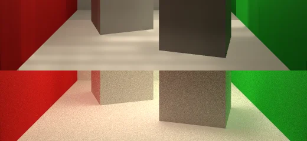
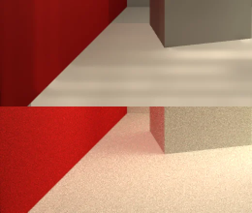
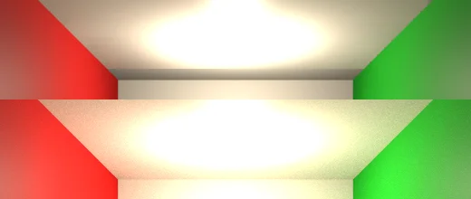
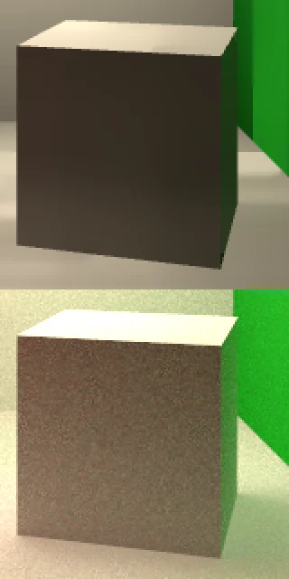
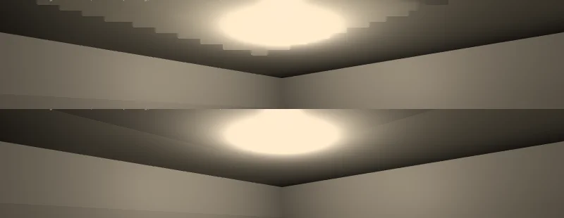

# Rendering

What the renderer draws, how a frame moves through it, and the order it grows in. The target is a
forward renderer that a reader can follow end to end in an afternoon, with enough of a frame graph
underneath that shadows, post processing and render targets slot in as nodes, and nothing that
needs an offline toolchain beyond `slangc`.

## What exists

- **A Vulkan device** (`GraphicsDevice`, over Vortice.Vulkan) targeting Vulkan 1.3 with
  `VK_KHR_swapchain`, three frames in flight, mailbox presentation where the surface offers it, a
  depth image of its own, and optional validation layers. Buffers and textures are carved out of
  blocks (`GraphicsDevice.Memory`). `IGraphicsDevice` is the interface the rest of the engine draws
  through, and `NullGraphicsDevice` stands in for it in tests.
- **Dynamic rendering and synchronization2.** A pass is begun on the images it draws into
  (`GraphicsDevice.Rendering`), with no render pass object or framebuffer made ahead, and moves
  them into their attachment layouts and out to the layout they are read in by barriers of its
  own. A pass (`IRenderPass`) is only the formats and samples it draws at, compared by value, which
  is all a pipeline is made for, so the caches of pipelines key on it. Every barrier is
  synchronization2's (`GraphicsDevice.Barriers`).
- **A frame in three steps**, each a list of systems in `Renderer`:
  1. **Extract** copies what the frame needs out of the game's `World` into a separate `RenderWorld`
     (`CameraExtract`, `LightExtract`, the draw lists), so the game can change its world while
     the frame is drawn.
  2. **Prepare** uploads what changed (`GpuMeshesPrepare`, `GpuTexturesPrepare`,
     `LightingUboPrepare`) and fills per-frame buffers through `DynamicBufferAllocator`.
  3. **Graph** runs the render graph's nodes in topological order. `MainPassNode` begins and
     clears the swapchain pass, and the model, immediate and ImGui nodes draw into it. Once the
     pass has ended, a node drawing into windows of its own does so in `AfterWindowPass`, as ImGui's
     does for its viewports, each window's swapchain image acquired as it is drawn, waited on and
     signaled by the frame's one submit and presented by its one present beside the main window's
     (`GraphicsDevice.Windows`).
- **The immediate pass** (§2) draws the shapes and textures the flat API records.
- **The model pass** (§3) draws the meshes `DrawModel` records and every mesh entity, which
  `MeshEntityDraws` records through each camera entity, lit by the light entities or, with
  none, drawn unlit as raylib draws them (§4).
- **Shaders** are Slang, compiled to SPIR-V by `slangc` and cached (§1).
- **A distance field of the scene** around the window's eye, in cascades built on the GPU from the
  meshes that cast shadows, which ambient occlusion, the sun's contact shadows and particles read
  (§4), and **light that bounces** traced through it as Radiance Cascades each frame (§4).
- **A frame profile** of the schedule's stages, the renderer's steps and each pass on the CPU and
  the GPU, with two stress examples that find how much a frame holds (§6).

## 1. Slang through slangc

Every shader is a `.slang` file holding all of its entry points, and `SlangLoader` turns it into a
`ShaderProgram` with the SPIR-V of each stage. A function marked `[shader("vertex")]` or
`[shader("fragment")]` is an entry point, and its SPIR-V names it `main`. `SlangCompiler` runs
`slangc` per stage with `-target spirv -matrix-layout-column-major`, which gives `mul(matrix,
vector)` the meaning `matrix * vector` has in GLSL over the same bytes, so the engine uploads
`System.Numerics` matrices unchanged.

Each result is cached in `source/.slang-cache` beside the running program, keyed by a hash of the
source, the entry point, the arguments, and every file it imports or includes, looked for beside
the file that names it and then in the import directory as slangc looks, followed through their
imports, with paths written with forward slashes. A machine
without `slangc` reads the cache, an entry whose sources have changed is never used, and a shader
added beside the others leaves their entries valid. `e3d shaders <folder> <cache>` fills a cache
ahead of time, which is how `build/pack.sh` ships the built-in shaders compiled.

`slangc` is a tool rather than a library. `build/fetch-slang.sh` downloads a pinned release into
`build/tools/slang`, and the compiler is looked for in `ENGINE_SLANGC`, then on the `PATH`, then
there. Linking Slang into the engine would add a native library of tens of megabytes to every
game for the sake of compiling while it runs, and running `slangc` as a process does the same with
nothing shipped.

Slang is chosen over GLSL because one language covers vertex, fragment and compute with modules,
generics and interfaces, and because the same source can later target Metal or Direct3D without a
second set of files.

`slangc -reflection-json` is read for the uniforms a shader declares at the top level, for every
descriptor in every set, each with its set, binding and kind (a uniform buffer, a combined image
sampler, a sampled image and the sampler declared apart from it, a storage buffer or image), and
for each input of a vertex stage by its semantic, all cached beside the SPIR-V. Descriptor set
layouts are made from it (`ShaderProgram.LayoutOf`): the model pass's material and lights sets
from `model.slang`, the bloom, composite and FXAA passes' from their shaders, and a program's own
shader's set 0 joined with what its pass binds (`ShaderProgram.Merge`), so a binding added to a
shader reaches its pipeline with no layout written for it. The vertex formats are the engine's,
each attribute written once beside its pass with the semantic it is read by
(`VertexStream`), and a vertex stage of a program's own is fed each at the location Slang gave its
semantic, so it may declare its inputs in any order. A stage whose inputs carry no semantic, or a
cached one from before they were kept, is fed at the engine's own locations.

Compute shaders are compiled from a function marked `[shader("compute")]`, and their storage
buffers found in the reflection as structured buffers, apart from textures. A dispatch
(`GraphicsDevice.Dispatch`) is submitted at once to the queue the frames use, in a command buffer
of its own with a barrier before it against every earlier write and one after it for every later
read and the CPU's, and a fence the next dispatch or a wait frees its objects by. It runs after
the frames already submitted and before the one being recorded, which is submitted at
`Stage.Last`. Storage buffers are host-visible, so `ReadShaderBuffer` and `UpdateShaderBuffer`
wait for the dispatches in flight and copy through the mapping. `UpdateShaderBuffer` does not wait
for the frames in flight, so one still drawing from a buffer may see the write.

A compute shader writes a texture it declares as `RWTexture2D`, which the reflection tells from a
sampled one by its access, and samples a `Sampler2D`, both set with `SetShaderValueTexture`.
Textures are made with storage usage, and their sRGB views for sampling only, since an sRGB format
cannot be storage. The image a dispatch writes is moved to the general layout in its command buffer
and back to the one textures are sampled in after it, and the shader's image carries no format,
which the device's `shaderStorageImageWriteWithoutFormat` feature, enabled where it is supported,
allows. A render target's colors are made with storage usage where the device stores their
formats, asked once a format (`StoresTargets`), and as a transfer's destination. Where it does not,
as some devices do not store the window's eight-bit BGRA, the shader writes a stand-in of eight
bits a channel in RGBA order or of the target's floats, which every device stores
(`GraphicsDevice.CreateStandIn`), kept with the target's texture. The dispatch blits the target into
it before the shader and blits it back after, a blit taking each channel into its own where a copy
would move the bytes as they lie, and a test writes one target both ways on a device that stores
it and compares the pictures. A texture reaches the GPU in the frame after it is loaded, so a
dispatch before then is skipped with the reason in the log.

A shader that draws reads storage buffers too, declared as `StructuredBuffer`, at the bindings
Slang gives them in its first set. The buffers set on it travel with each draw after the
textures in the draw's snapshot of its own textures, and the immediate and model passes bind them
in the set a shader with resources of its own has, from `ShaderBufferStore`, which the render
world is handed. A buffer a draw was not given is bound to 16 zero bytes. The dispatch's barrier
after it makes what it wrote visible to the frame drawn after it, so a simulation stepped on the
GPU is drawn with no copy through the CPU, as `shaders_compute_life` draws its grid.

## 2. The immediate pass

`Draw` calls from the flat API (see [DESIGN.md](DESIGN.md)) record into the `DrawList` resource, a
growing array of 24-byte vertices (position, texture coordinate and color) and a growing array of
32-bit indices into it, split into batches. A quad, which every sprite, glyph and rectangle is, is
four vertices and six indices. A batch is a run of consecutive shapes with the same topology (lines
or triangles), transform, depth mode, texture, blend mode and scissor, so a scene of shapes drawn
through one camera is two batches. Untextured shapes sample a white pixel, so one shader draws
both. `ImmediateNode` runs after `main_pass` and before ImGui. It writes the frame's vertices and
indices into the dynamic buffer arena in one copy each and issues one indexed draw per batch with
`immediate.slang`, the batch's transform a push constant. The list is cleared in `First`.

A batch also carries a shader id and four `float4` values. Inside `BeginShaderMode`, the batch draws
with the stages of a program the flat API compiled (`ShaderStore`), whose fragment stage, and
vertex stage when it has one, replace the engine's. Every immediate shader imports
`shaders/engine.slang`, which declares the vertex output, the texture binding and the 128-byte push
block (the transform, then the four values), so a program's shader matches the pipeline without
declaring any of it. Uniforms a shader declares at the top level, which Slang puts in a uniform
buffer at binding 0, travel with the batch as the bytes they held when it was recorded, and the
batch binds a set of its own with them beside its texture, from a ring kept per frame in flight.
Textures a shader declares beyond the module's, found by name in Slang's reflection, take the
bindings Slang gave them, binding 0 among them for a shader with no uniforms, so such a shader
has a descriptor layout of its own built from them, and the batch's set holds the textures
`SetShaderValueTexture` set, as they were when it was recorded. A model shader's are the same,
beside the material's maps. A `SamplerCube` is marked in the reflection, and the shader cache
keeps the mark, so it is bound the cube view of a texture `LoadTextureCubemap` made, eight bits a
channel in six layers, or a black cube where none is set, and a 2D slot handed a cube binds the
white texture, since neither view can stand for the other.
An unloaded shader's stages and pipelines are destroyed after the frames in flight that might use
them.

This is raylib's rlgl layer in Vulkan terms. It keeps shapes, grids, gizmos and debug lines out of
the ECS and out of the mesh path. A batch carries the faces it culls, the back ones of a shape
drawn inside `BeginMode3D` and none of a 2D one until rlgl's culling is switched, so a 2D shape's
triangles may wind either way, and its pipelines blend by alpha unless a batch was recorded
inside `BeginBlendMode`, which makes a pipeline for each of raylib's modes the batch asks for. Alpha
is laid over by alpha in every mode, so a render target keeps the coverage of what was drawn into
it. A batch recorded inside `BeginScissorMode` carries its rectangle, clipped to the target, and
the pass sets the scissor to it and back to the whole target after its last batch. A texel with no
coverage is discarded, so a sprite's empty corners write no depth.

A line drawn at one sample a pixel takes the pixels OpenGL's would, by the diamond rule of the
line rasterization extension's Bresenham mode, where the device has it, so a grid lands where
raylib's does. With several samples a line stays the driver's, whose samples smooth it. OpenGL
counts rows up the screen and Vulkan down, so the two break a tie between rows the other way round,
a line on the boundary between two rows drawn on the lower in raylib and a pixel whose middle is on
a shape's lower edge filled there. The pass moves every untextured batch a 256th of a pixel down
the screen after its transform, which breaks each tie as raylib's does. A textured batch is left
where it is, since a texture filtered between its texels would take a trace of the next row.

Textures loaded through the flat API go into `TextureStore`, and `GpuTexturesPrepare` uploads them
before the graph runs, keeps one image, view, sampler and descriptor set per texture for every pass
that samples them, and destroys an unloaded or replaced texture's objects four frames later, once
no frame in flight can read them. A texture's filter and wrap are its sampler's, so changing either
replaces the sampler and set and keeps the image.

## 3. Meshes and materials

Every mesh draws through one pass, `ModelNode`, before the immediate shapes: the flat API's
models and the ECS's mesh entities alike. A mesh is uploaded once into host-visible vertex and index buffers (32-byte
vertices of position, normal and texture coordinate, 32-bit indices) through `MeshStore` and
`GpuMeshesPrepare`, and `DrawModel` records a mesh, a world transform, the camera and a material
each frame. Draws of the model pass's own shader that share a mesh and its five maps are one
instanced draw, in the order each such batch first appears. Each draw is an instance of 96 bytes
in a second vertex buffer stepped per instance (`ModelRenderer.Instance`, `ModelInstance` in the
shader), holding the world matrix as three rows of a 3x4 (the rotation for normals and the
translation for world positions) and the material's factors. The camera's view-projection is a
push constant for the batch (`modelPush`), as a light's is in the shadow pass, so draws recorded
through two cameras are batched apart. `model.slang` shades by the frame's lights, or when the
world has none and no environment draws the color unlit, texture times color with the light the
material gives off, as raylib's default shader draws a model.
`model.slang` is built on the `modelpass` module, which a model shader of the program's own imports
too. A draw with one is drawn by a pipeline made from it, and its uniforms, copied when the draw
was recorded, reach it in a uniform buffer at binding 0 of the first descriptor set, where Slang
puts uniforms declared at the top level, beside the texture at binding 1.

A mesh entity is a `Mesh` (positions three per triangle, with optional normals and texture
coordinates) and a `Material`. `MeshEntityDraws` uploads its arrays once, keyed by the positions
array, frees them the first frame no entity draws them, and copies the material's base color,
normal and metallic-roughness texture assets into `TextureStore`. A triangle without normals is
lit by its face's normal.

A draw's maps are in its set, the first. Its base color texture, normal map, metallic-roughness
map, emissive map and occlusion map are at bindings 1 to 5. Its factors are in its instance, its
color and emission linear, decoded on the CPU, then its metallic, roughness, normal and occlusion
strengths, and the vertex stage hands them to the fragment stage unblended across the triangle.
The instances are written into a ring kept mapped, with a region per frame slot, the shadow pass's
and each target's one after another, and a ring outgrown is replaced by one twice the size. The
model pass's own draws share one set per combination of maps, so draws differing only in their
factors share a set and a draw call. A set no frame in flight binds is freed. A draw with a shader
of its own is a batch of one, with a set of its own holding its uniforms.

A material is double-sided unless it says otherwise, as a glTF file can, whose draws are batched
apart and drawn by a pipeline that culls back faces. The back of a double-sided face is lit by its
normal turned toward the viewer, as glTF has it. A format that does not say, as OBJ, is
double-sided.

A material's alpha mode says what its alpha means, as glTF's does. Opaque ignores it. Mask cuts
the surface out where the color times the texture is below the cutoff and leaves the rest solid,
in the opaque batches. Blend, the default for a material the program makes, lets what is behind
show through. The mode reaches the fragment stage in the instance's emission `w` (below zero for
opaque, the cutoff for mask, zero for blend), read by `alphaTested`. A tint with alpha on a model
whose file says opaque blends it, as raylib's tint fades a model.

The pipeline blends by alpha and writes depth, so a draw that lets what is behind it show must
come after that. A draw is translucent when it blends and its color has alpha below 255 or its
base color texture has a pixel neither clear nor solid (`TextureStore.IsTranslucent`, found when
the pixels are uploaded). It stays out of the opaque batches and is drawn after all of them, in
the order the program recorded it, batched only with the draws beside it that share its mesh and
set. `MeshEntityDraws` records its translucent entities after the opaque ones, from the farthest
from the camera to the nearest.
A normal map's tangent frame is worked out per pixel from the derivatives of the position and the
texture coordinates (Christian Schüler's cotangent frame), so a mesh needs no tangents, and up in
the map is toward the top of the image, as glTF has it.

What follows is where meshes go from there.

A mesh carries position, normal, tangent, two texture coordinates and a color, interleaved, with
32-bit indices. Models come from Assimp, which supplies the mesh data, the material factors and the
texture paths in one pass, and textures are decoded by StbImageSharp with mipmaps generated on the
GPU.

The material holds glTF's metallic-roughness model, which Assimp maps every format it reads
onto, and all of it is drawn. Emission is added after the lights, so it shows with none.
Occlusion darkens the light from all around (ambient lights), and leaves a lamp's light to the
shadow map. A program that needs something else writes a Slang shader that imports `modelpass`.

A skinned mesh is posed on the GPU. When a model is loaded, each skin hands the mesh store its
four joints and weights a vertex (`MeshStore.SetSkin`), and `GpuMeshes` makes a `GpuSkin` for it:
the vertices at rest, the joints and the weights in storage buffers, a vertex buffer the posed
vertices are written into, which the model pass draws, and a ring of buffers for the joints'
matrices, one more than there are frames a buffer is read in. A pose hands over only the
matrices (`MeshStore.PoseSkin`), and `SkinningNode`, the first node of the graph, records for
each mesh posed that frame a dispatch of `skin.slang` into the frame's command buffer, with a
barrier before it that waits for earlier frames to finish reading the vertex buffer and one after
it that makes the posed vertices visible to the shadow and model passes. A matrix is four rows,
applied as System.Numerics applies a matrix to a row vector, so the CPU's layout is read as it is.
With no renderer the CPU poses the vertices itself, as it did before, and they are the mesh's own.

Morph targets ride the same dispatch. A mesh's targets, read from glTF through Assimp as how far
each moves each vertex, are a sixth storage buffer of the skin, two float4 a vertex (position and
normal) target after target, and each frame's weights follow the joints' matrices in the ring's
buffer, with a push constant of the joint and target counts. `skin.slang` moves a vertex toward its
targets before the joints move it. A mesh with targets and no skeleton is given a skin of one joint
that never moves, so it takes the same path. A clip's weight channels are sampled with its bones
(`ModelAnimation.KeyframeMorphWeights`), and `SetModelMorphWeight` poses the model again as its bones
were last posed. A clip played on part of the skeleton (`UpdateModelAnimationLayer`) takes each
bone's pose relative to its parent from the second clip from a bone down, and composes it onto
where the first clip puts that bone's parent.

Particles take the skins' path too. `ParticleExtract` copies each `ParticleEmitter`, placed by its
entity's world matrix, with the window's camera (`MeshEntityDraws.WindowCamera`) and the frame's
seconds, held to a tenth of a second. `ParticleRenderer` keeps a storage buffer for each emitter, a
header of four float4 values and then two a particle (position and age, velocity and life), and the
`particles` node, after `skinning`, records a dispatch of `particle_step.slang` for each, a thread a
particle, with everything the step and the draw need in its 128 bytes of push constants. The frame's
births are its share of the rate, the fraction owed carried to the next frame, and its burst, in a
run of slots after the last frame's, so the oldest are replaced, each started within the emitter's
radius with its velocity turned within the cone and its speed and life varied by a hash of its slot
and a seed of the frame and the emitter. The first thread writes the colors, sizes and brightness
into the header, which the draw reads, so nothing of an emitter is written from the CPU while a
frame in flight reads it. A particle alive falls by gravity and slows by the emitter's drag, as an
exponential of the step, whose bits ride in the push block's last word. Where an emitter collides,
the node first draws the window's meshes that cast shadows into a depth at half the window's size,
with `DrawDepth`, as ambient occlusion draws its own, and binds it with the view it was drawn
through as the step's second set, one written each frame in flight, and the white texture with
collision off in frames none collides. The step finds a particle's pixel in that depth, the surface
there in the world through the inverse view-projection, and its normal from the texels beside it,
turned toward the camera, and a particle that crossed that surface's plane from the camera's side in
the step bounces off it, keeping the share of its speed into it that rides with the collision's two
bits in the capacity word's spare high bits, or ends there. A particle already behind a surface, as
one passing behind a post, crosses nothing. On `shaders_particles` the depth costs the graph about
0.03 ms of CPU and the GPU about 0.01 ms. The draw (`particles.slang`) imports the model pass, binds
its material set with the emitter's texture as the base color, white without one, and the window's
lights set as sets 0 and 1 and the particles as set 2, and draws six vertices an instance, a square
facing the camera's eye that `eyeInWorld` finds from the view-projection, over the window's scene
decoded to linear light (§5) or after a target's meshes into the target, depth tested and not
written, added or laid over by alpha. The square is a round dot, or the texture tinted where the
emitter has one, whole or the frame of a sheet the share of the life gone picks, mixed with the next
frame by how far the life is through its own where the emitter blends them, the branch on the
emitter's setting so both samples are taken where every pixel takes them. The look's last value
packs whether it is lit and textured, the sheet's columns and rows and whether they blend into an
integer a float holds exactly, since the push block has no room left. A lit particle goes through
`lit` as a rough surface facing the camera and an unlit one through `toDisplay`, so both follow the
view's output flag, and the window's particles undo the window's encoding, since they are drawn over
its decoded light, so an additive cloud adds up in linear light as a glow does. Emitters laid over
by alpha are drawn after the additive ones, from the farthest from the camera's eye to the nearest
by where each emitter is. Within an emitter laid over by alpha, `particle_sort.slang` sorts after
the step, in the emitter's buffer after its particles, a key a particle of its negative squared
distance from the window's eye, a large one for the dead and infinity for the padding to a power of
two, by Batcher's bitonic sort. Blocks of 512 keys are sorted in a workgroup's shared memory in one
dispatch, and an emitter of more takes a dispatch for each step across blocks and one for the steps
within them after it, so 400 particles cost 0.02 ms of the GPU where a dispatch a step took 0.47. A
render target drawn through a camera of its own sorts them again from its eye before its pass, and
the window again from its own before its scene's particles are drawn where a target sorted after it
(`ParticleRenderer.SortFor`), each emitter keeping the eye its buffer was last sorted from: an
emitter of 300 in `games/Sumo`'s two views added 0.025 to 0.03 ms of the GPU to `targets`, as `./e3d
command profile` gives it, 0.38 against 0.35. The step clears and the sort sets a flag in the
header, by which the draw reads each instance's particle through the sorted keys. `TargetsNode`
draws them into each render target after its meshes, with its own lights, since the step runs before
the targets, through the camera of the target's first `BeginMode3D`, which `Mode3DCamera.Targets`
keeps, or the one its meshes were drawn through for a camera entity's texture. A target drawn only
in 2D has no camera for them. A reflection probe's capture draws them into each face after its
meshes, through the face from the probe's middle, lit by the capture's lights, so a fire in a room
glows in its metal.

## 4. Lights and shadows

`LightExtract` copies every `Light` entity into the render world, and `LightingUboPrepare` packs up
to 16 into one uniform buffer per frame, which `ModelRenderer` binds as a second descriptor set from
a ring of one per frame in flight. The set's images, seventeen of them, are bound apart from two
samplers they share, one blending and one reading the nearest texel, since Metal allows a stage
sixteen samplers and a combined image sampler counts as one, so the model pass's fragment stage
reads seven with the material's five maps and a program's shader has nine left. The device reads its
limits of samplers and images a stage when it starts and refuses a pipeline past them with a
sentence of the counts (`GraphicsDevice.Limits`), where the driver would draw nothing, and a test
holds every built-in shader to sixteen. A `Light` is a kind (directional, point, spot or ambient), a
color, an intensity, a range and a spot's inner and outer angles, and each is one 64-byte entry.
`lights.slang`, which `modelpass.slang` imports beside the set it reads (`lightset.slang`), adds
each light by Lambert's cosine: a directional light by its direction, an ambient light everywhere
alike, and a point or spot by the square of the distance, brought smoothly to nothing at its range
and cut by a spot's cone. The light that arrives is reflected by the
material's metallic-roughness model. Each light but an ambient one reflects by GGX's
distribution, Smith's height-correlated shadowing and Schlick's Fresnel, toward a camera the
shader finds from the transform alone, since the push constants have no room for its position,
and scatters diffusely what Fresnel leaves, none of it off a metal. An ambient light scatters its
diffuse share and reflects the share Karis's fit of the environment term gives with no
environment to reflect. A light's color times its intensity is the light a white diffuse surface
facing it returns, so the diffuse term is the albedo itself and the specular term is multiplied
by pi to match.

The pass lights in linear space. Frames and render targets stay UNORM and hold sRGB-encoded bytes,
so the immediate pass, text and every 2D color stay byte for byte as raylib draws them. A texture
image can also be viewed as sRGB, and the model pass samples a base color through that view, so
the sampler decodes it before filtering. A draw's color bytes are decoded in the shader, and normal
and metallic-roughness maps are read as linear, as glTF has them. A light's color and intensity
are linear. The pass encodes what it returns, and `toDisplay` does the same for a model shader of
the program's own that works out a color itself.

The sum goes through a tonemap that leaves the brightest channel alone up to 0.9, bends it smoothly
toward 1 past that, and scales the other two channels with it. A sum past one keeps its hue where a
clamp per channel turns it white, and a color below the bend is unchanged. A world with no light
entities and no environment draws its models unlit, so a color near white keeps its shade as
raylib's does. Where the curve runs depends on the view, which a flag in its lighting buffer,
`output`, tells `toDisplay` and `unlit`. The window's view, `output.y`, writes its light into the
HDR frame sRGB-encoded with no curve, carried on past 1 (`linearToSrgbPastWhite`), and the curve
runs once over the frame in the composite (§5), after the frame's blending, from the module
`color.slang` both import. A render target's view, neither flag, has eight bits to hold its light,
so its curve and encoding run at the end of the model pass. A reflection probe's faces, `output.x`,
keep their light linear.

An `EnvironmentMap`, a world resource set by `SetEnvironmentMap` from an equirectangular image,
lights a frame from all around. A Radiance `.hdr` file is read as linear floats, so a sun keeps its
brightness past white, and an eight-bit image is decoded from sRGB through a table of half floats,
an image wider than 4096 halved until it fits, which is all the CPU does. The `environment` node,
ahead of every pass, uploads the image of a map it has not seen with its mips and filters it on the
GPU (`GraphicsDevice.RecordEnvironmentFilter`) with the stages a reflection probe's capture goes
through, below. `env_gather.slang` resamples the image into a source cube twice the target's width,
each texel averaging four samples read from the image's mip whose rows are as far apart as the
samples, and into the sky cube. The image's own mips would weigh a row by its length, which near a
pole holds one direction many times over, where a cube's texels differ in solid angle by a factor
of about five at most, so the source's mips weigh each direction by what it covers and a light at
the zenith is spread as one on the horizon is. The target is a half-float cube with faces 64 texels
wide, mip 0 for a mirror and each mip after for a roughness of `mip / (mips - 1)`, by GGX
importance sampling with the eye along the normal (Karis's split sum), each sample reading the
source at the level its solid angle covers. The model pass looks the mirror direction up at the mip
for the surface's roughness, weighted by Karis's fit, and lights the diffuse share by the image's
irradiance, both darkened by occlusion. The irradiance is the source projected onto the nine
spherical harmonics of bands 0 to 2, each band scaled by its share of a cosine lobe (Ramamoorthi
and Hanrahan), so a surface takes the light of the whole half of the sky it faces. The cube is set
1's binding 2, a black cube when there is none, the irradiance a storage buffer at binding 14,
zeros when there is none, and the lighting buffer carries the map's intensity and its last mip.
With a map set models are lit by it, whether or not there are light entities.

The filter writes a second cube for the sky, at a quarter of the image's width a face up to 512
texels, resampled with no prefiltering, at set 1's binding 3. `DrawSkybox` records a model draw
of a cube around the camera with `sky.slang`, which looks the sky cube up along the way from the
eye through each pixel and sets its depth a millionth inside the far plane, so whatever else the frame
draws is in front. The draw goes through `toDisplay` and the curve like a reflection does, and is
left out of the shadow map (`ModelDraw.CastsShadow`).

A `ReflectionProbe` entity, which `CreateReflectionProbe` makes, is a box whose surfaces reflect
what is around its middle rather than the environment map. `ProbeNode`, after the window's shadow
and before its passes, captures the first probe out of date, one face a frame. The window's batches,
or the first render target's when the window draws no meshes, are drawn through six views of a right
angle from the probe's middle into half-float render targets of 64 texels (`ModelRenderer.Draw` with
a view-projection pushed in place of each batch's), lit by the window's lighting buffer with its
output flag set, so the light stays linear and as bright as it was drawn, cleared to the window's
clear color in linear light. The frame that draws the sixth face filters them on the GPU after it
(`GraphicsDevice.RecordProbeFilter`), so a capture costs that frame's work and nothing is read back.
`probe_gather.slang` fills a cube of faces 64 texels wide, each texel reading the face that looks
most nearly along it through that face's own view-projection, and `probe_mips.slang` makes its mips,
each texel the average of four. `probe_prefilter.slang` writes the probe's cube of faces 32 texels
wide (`FilteredCube`), mip 0 for a mirror read from the gathered cube's level of the same width, and
each mip after by GGX over 64 samples, each read from the gathered level its solid angle covers, as
the environment map is filtered. `probe_irradiance.slang` projects the gathered cube's level 16
texels wide onto the nine harmonics in one group of 64 threads, into a storage buffer of the probe's
own. A source cube of each width is made once and shared by every filter. A probe is captured twice,
the second time with the first bound, so the metal in its room reflects the room in the capture
rather than the sky. A probe whose map is of an earlier placement or of lights since changed gives a
capture no light, its intensity 0 in the capture's lighting buffer, so its first pass sees only the
lights and its second bounces that. `ReflectionProbes.Sync` keeps the lights that reached each box
when it was last asked for, and asks again when one is added or removed, grows or dims by a quarter,
turns color, or moves a quarter of a unit or turns past eleven degrees, so a lamp switched off is
seen and a flickering one is not. A probe whose `Refresh` is above 0 is captured again that many
seconds after each capture, one pass with the last bound, while what it is wanted as stays, so it
stays ready, and a capture a placement or a light needs goes before a refresh, the refresh of the
probe captured longest ago first. Four probes with a capture, those whose boxes come nearest the
camera, are bound at set 1's bindings 5 to 8 and their irradiance buffers at 10 to 13, and the
lighting buffer carries each one's middle, intensity, half size and last mip after the
environment's. A surface in a box takes its reflection and diffuse light from the smallest box
holding it, the reflection looked up where the reflected ray leaves the box (box projection), and a
surface in none keeps the environment map.

The first directional light with `CastsShadows` set casts the frame's one shadow, in three cascades.
`ShadowFit` cuts each view's camera out to 150 units into slices ending at 12, 45 and 150 units, or
out to the distance `SetShadowDistance` puts in `ShadowSettings` in the same proportions, and fits a
tile of a depth map two tiles on a side, 2048 texels a tile unless `SetShadowMapSize` puts another
size in `ShadowSettings`, to the sphere around each, so the near slice spends its texels on a few
units and the far one on many. Each is moved in whole texels so the edges of shadows hold still as
the camera moves, and reaches four radii further toward the light for casters above the view. Ten
spot lights with `CastsShadows` set draw into the fourth tile, ranked by what they matter to every
camera the frame draws meshes through, the window's and each render target's: those whose reach
(their range around them, or the shadow distance for one with none) a camera's frustum holds come
first, then those whose light reaching an eye is greatest, their brightness over one plus the square
of how far their reach is from it, times the share of that camera's picture their reach covers, its
box put through the camera and held within the picture, the whole of it where the box reaches round
past the eye (`LightingUboPrepare.Rank` and `Share`), the most of any camera, then those whose reach
comes nearest one. So a lamp lighting a wall across the view keeps its shadows over a brighter one
lighting a corner of it, at no cost that can be read, `prepare.LightingUboPrepare` in `./e3d command
profile` taking 0.010 ms in Wick's first doorway and 0.017 to 0.020 ms in Manor's hall with the
share and without. The tile is the whole of it for one, a quarter each for up to four, and past four
a quarter each for the first two and a sixteenth each for the rest, in its lower half
(`ShadowFit.SpotTileArea`), each through a perspective projection from the light as wide as its
outer cone and as deep as its range, or the shadow distance for a light with none. A shadowed spot
light carries its slot, counted from one, in its cone's third component, as a point light does, and
its projection and texel width ride in the lighting buffer. `ShadowNode` clears the map once and
draws the window's meshes into each tile in use, before the window's passes, with `shadow.slang`'s
vertex stage and no fragment stage, through a depth-only pass (`GraphicsDevice.CreateShadowMap`). A
render target that draws meshes has cascades fitted to its own camera and a lighting buffer of its
own (`TargetShadows`), and `TargetsNode` draws the map for it before its pass, so a split screen
drawn into two textures shadows each view. Views whose cameras are near enough share one set of
cascades fitted to all of their cameras (`ShadowFit.FitCascades` over several), each joining the
first group whose first cascade fitted to all of it is no more than a quarter wider in its texels
than any member's own (`LightingUboPrepare.SharedTexelGrowth`), so a view reads its shadows from the
shared map as from its own, and a group drawn one after another draws the map once, by its first
view with that view's meshes (`ModelRenderer.ShadowMapsDrawn` counts the draws). With no sun every
view's map is the same and all share it. Sumo's two views, facing each other across the ring, share
theirs: its render textures take 0.35 to 0.37 ms of the GPU in `targets` where they took 0.45, and a
view of that layout differs from itself drawn alone at 77 of 28,800 pixels, along its shadows' edges
(`SharedShadowTests` holds two near views and two far apart to their own). The window's map is drawn
after every target, where it shares none with the last of them, and the point lights' faces, the
same from every camera, once a frame. Each view draws its own batches and instances, which its model
pass draws after it, reading each instance's world matrix, color and cutoff, and each tile and face
pushes its light's view-projection, so the frame's instances are written once for both passes. A
batch is gathered by the kind of shadow its draws cast as well, none, solid or masked, and a masked
one is drawn with `shadow.slang`'s fragment stage and its maps, which cuts it out below its cutoff
as the model pass does, so its shadow has its holes. A blended draw that is clear anywhere is drawn
the masked way too, its fragment stage keeping a texel where its alpha passes a threshold that
interleaved gradient noise spreads over the texels, so the nine samples the model pass averages give
a shadow as dark as the surface is opaque. The map is bound at binding 1 of the lights' set, beside
the cascades' matrices and texel widths in the lighting buffer, and the white texture takes its
place in a frame with no shadow. The shader takes the nearest cascade whose tile holds the point, a
little inside its edge, moves the point off its surface by a texel and a half of that cascade along
its normal, and averages nine comparisons around it. Across the outer fifth of a tile the next
cascade is read as well and blended in, so the shadow's softness changes over a band where one
cascade gives way to the next, and past the last cascade's band the shadow fades out rather than
ending at a line. A spot light's texels widen with distance from it, so its offset grows with that
distance. A model shader with a vertex stage of its own casts the shadow of its mesh as it was
before that stage moved it.

Twelve point lights with `CastsShadows` set, chosen and ranked the same way, shadow everything
around them, each in six faces, a little wider than a right angle so the nine comparisons near a
face's edge stay on it. The first four have faces of a quarter of a tile, 512 texels by default, a
layer each, and the other eight half that, four faces to a layer after theirs
(`ShadowFit.PointFaceArea`), 36 layers in all, with each comparison kept inside its own square. The
faces are layers of a second depth image, each layer cleared once and drawn with the faces it holds, with the
shadow pipelines and sampled as an array at the lights' set's binding 4, and their views and
projections ride in the lighting buffer after the lights, in the order +X, -X, +Y, -Y, +Z, -Z. A
shadowed point light carries its slot, counted from one, in its cone's third component, and the
shader picks the face by the axis the point lies furthest along, which is the face whose view
holds it, so no cube map's conventions have to agree with the matrices. The image is moved to the
layout it is sampled in when it is made, so its layers can be bound before any is drawn, and until
a point light casts a shadow a stand-in of two texels is bound in its place.

### The scene's distance field

`SetSceneField` builds a signed distance field of the meshes drawn into the window that cast
shadows, in cascades of 64 cells a side around the window's eye, each twice as coarse and as wide
as the one before, for the passes that need to know what the window's depth does not hold
(`SceneFieldRenderer`, `GraphicsDevice.SceneField`). The cascades lie one after another along z in
one 3D image of half floats, which every pass binds once with a uniform buffer saying where each
lies (`scenefield.slang`). A cell holds its distance to the nearest surface in world units, below
zero behind a face of a mesh that is not double-sided, exact within four cells and held at four
beyond, so a trace through it steps at least that far through open space.

A cascade's corner lies on a grid of eight of its cells, so it moves only when the eye has gone that
far, and where it moves, or a still mesh came into it or left, it is built again, as many a frame as
the budget allows, the finest first (`SceneFieldPlan`). Until then a cascade keeps the place and the
meshes it was built with, which the uniform buffer says, so a pass never reads one cascade at
another's place. A mesh is still when it has been drawn the same, mesh, vertices, matrix and sides,
for eight frames running. Its triangles go into one buffer in its mesh's own space the first time a
build needs them, so a build hands the GPU each instance's matrix and where its mesh's triangles
start. A build clears a word a cell to the band, then a workgroup a triangle puts the triangle in
the world and takes, for each cell within the band of its bounds, the distance to it in 1024ths of
a cell above a bit set where the triangle is double-sided, a bit set where the cell is in front
of the face and the way the face looks in eight bits, keeping the least by an atomic minimum
(`field_splat.slang`). Of two triangles as near, as a crate on the ground, the one the cell lies
behind wins, the cell being inside some mesh, and a cell is behind a face only within 60 degrees of
straight back from it, so where an edge or a corner is nearest, as above a pillar's rim, a face the
way runs along does not put the cell inside. A cell whose nearest point is on an edge no other
triangle shares by the places of its ends (`SceneFieldRenderer.OpenEdges`, the corner's w in the
pooled triangles) is in front, so a ground plane puts no wedge below its rim inside. The face a cell
lies within 25 degrees of straight behind is kept apart as well, in a word a cell. A
second pass turns the words into distances in both the image the meshes alone make and the one the
passes read (`field_resolve.slang`), half a cell less where the nearest triangle is double-sided. A
double-sided mesh has no inside, and a sheet of one between two rows of cells would leave half a
cell in each, which a trace steps over, so held half a cell thick on either side it crosses zero
wherever it lies, as the walls and floors of Manor's rooms, imported from OBJ files, need. A closed
wall thinner than a cell may have no cell's middle inside it either, and a cell in front of one face
and less than a cell before another straight behind it that looks the other way takes the middle of
the two, less half a cell, so the wall is held as the sheet is. The faces of a box's edge, which
meet square, are not taken for a wall. It took a cascade's build in `shaders_scene_field` from
0.44 ms to 0.46 on the GPU (`field.rebuild 4000`, Release). A second
dispatch of the splat paints each cell the color and the light given off of the triangle whose word
it kept, the material's color times its texture's average in linear light
(`TextureStore.AverageColor`), into an image of each beside the distances, for the light that
bounces. An emitter thinner than a cell, as a strip on a wall, may be no cell's nearest surface, so
where an instance's thinnest extent is under a cell a third dispatch lends the cells within a cell
of its triangles its light and the area of its faces near each, those a closed mesh turns toward
the cell, within a square a cell wide about the cell's middle laid on the face, seen along each
axis, and the resolve gives a cell the larger of its nearest surface's light and the lent light
times the share of a cell's face those faces cover along the axis they cover most of, a whole face
at most. The lend's buffer, six words a cell, 6 MB, is made the first time a build has such an
emitter.
A mesh that moved more recently, a skinned one, and a still one whose cascades are not yet built
again are stamped each frame as boxes, the nearest the eye first to 256 boxes, into the
bricks of four cells they come within the band of, each cell the least of the still image's
distance and those of the boxes that come within its brick, which the plan lists brick by brick
(`field_stamp.slang`), and the bricks stamped the frame before are stamped again so a box that left
one is gone. A cell is painted the color of the nearer of the still meshes and the boxes, a box its
mesh's color as the splat reckons it, from a copy of the still meshes' colors the resolve writes
beside the image the passes read, so a cell a box painted takes the still color again once the box
has left. The light a mesh gives off is not stamped, which would take a copy of the still light as
well, 2 MB a cascade. A skinned mesh is a box for each joint around the vertices at rest it holds most,
posed by the joint's latest matrix, and one that does not bend a box for each of up to eight parts
its triangles are cut into where each cut takes a third of the volume away
(`SceneFieldRenderer.Cut`), or the box around all of it. A mesh past what the room left for a box
each of the meshes beyond it is the box around all of it, so a crowd past 256 boxes is figures near
the eye and boxes beyond. Three dancing robots in `shaders_cornell_box` are 147 boxes in 540
bricks, stamped and painted in 0.06 ms of the RTX 4070 (0.05 unpainted) and placed in 0.45 ms of the
CPU in the Release build, as their meshes' 57 boxes were.

Three passes read it. `ao.slang` adds an occlusion read along the normal and four ways leaning from
it at four distances out to the radius, and traces the sun's light toward the sun from a cell and a
half out, darkened by how near a surface the ray passes as a share of how far along it is, its
share in the occlusion image's green channel, which the model pass multiplies the shadowed
directional light by, so the pass runs for the contact shadows alone where the occlusion is off.
`particle_step.slang` steps a colliding particle's move through the field where the field holds the
place it moves to, and meets the window's depth elsewhere. `field_view.slang` draws one cascade over
the window as the field holds the scene, where `field.show` asks. A render texture drawn through a
camera of its own reads the field as the window does, for its occlusion, the sun's contact shadows
and the light that bounces, and a probe's faces read only the light that bounced through it.

### Light that bounces

`SetGlobalIllumination` traces the light that bounces between surfaces through the field each frame
as Radiance Cascades (`GlobalIlluminationRenderer`, `GraphicsDevice.GlobalIllumination`), in the
`global_illumination` node after the occlusion and before the probes. Nothing is baked.

A cascade of world probes lies every eight cells of the field's cascade of the same number, eight a
side, so each cascade's probes are twice as far apart as the one before's. Each probe traces an
octahedron of directions, a texel each, across an interval: the first cascade's from the probe to
four times the spacing, each after's from its spacing to four times that, so a cascade's interval
begins half way along the one below's (`gi_trace.slang`). `Low` traces 8 by 8 directions in each
of two cascades, `Medium` adds 16 by 16 in a third, and `High` traces 8 by 8 then 16 by 16 in four,
no more cascades than the field has. A ray that meets a surface brings back its painted color times the sun's light where a
trace toward the sun through the field gets through and the point and spot lights', each that casts
shadows only where a trace toward it gets through too (`hiddenLampLight`), given as the model pass
has a light, what a white surface facing it returns, and its color over pi times the light that
bounced to it the frame before, which the probes hold as the light reaching a face, blended from
the probes around it that it sees, a trace through the field to each in front of it
(`bouncedSeenAt`), with the light it gives off (`shadeProbeHit` in `gi.slang`). That light that
bounced is taken at a share each probe keeps, its whole but the frame after the probe's own light,
what its rays brought straight from the sun, the lights and what gives off light, fell by a fifth
or rose by a quarter, when it is the share its own light kept, channel by channel, at most four
times; the trace sums each workgroup of a probe's rays' own light and all they brought back, and
the gather adds the sums up and sets the share (`gi_ambient.slang`). A probe whose own light is
under a quarter of all its rays bring, lit by light that bounced around a corner, is judged by
the own light of the 27 probes of its cascade within one of it summed instead, which 27 of its
workgroup's rays read before the rest trace, and a cascade that moved since the frame before keeps
the whole. So the light that bounced on from a light that went out goes with it the frame after,
where it bounced on over the frames each bounce takes (`gi.toggle follow off`). A ray is traced
from its probe, so a probe a little above a floor does not bring back the light under it for the
cascade below to take, and one that meets a surface before its interval begins brings back that
surface's light for its own probe's faces, marked so the merge of the cascade below reads it as
dark, as that surface lies nearer the probe than the ray below reaches. A ray of the last cascade
that meets nothing brings back the environment map, or the ambient lights' color, and one of any
other cascade lets the light from beyond through. The three closed a room to a lamp over its roof
or under its floor, which lit it before nearly as brightly as the lamp unshadowed, at a cost within
the noise of 0.03 ms in `shaders_cornell_box`.

The cascades are merged from the last down (`gi_merge.slang`). A texel whose ray met nothing adds
the cascade above's texels inside its own, blended between the eight probes of the cascade above
around it by how near each is, a probe inside a mesh passed over, and a probe the field hides from
this one passed over too. The first eight threads of each probe trace those eight lines through the
field into shared memory before the probe's texels read them, so a probe under a ceiling takes
nothing from one above it, which sees the sky. Each probe of every cascade then sums its merged
light into six faces of a cube, irradiance from each axis's two ways (`gi_ambient.slang`), which a
ray's hit reads the frame after for the light that bounced to it, and the model pass reads where no
screen probe holds a pixel. Between the eight probes around a point, a probe is weighed by how near
it is and, as DDGI weighs them, how squarely it stands in front of the surface, and one behind the
surface's plane next to nothing, how near taken from a point half the probes' spacing off the
surface along its normal (`Lean` in `gi.slang`), so a wall lying in a plane of probes, which stand
inside it and hold nothing, takes the light of the row in front of it.

The first interval is traced again on the screen (`gi_screen.slang`). A probe stands on the surface
at the middle of each tile of 16, 12 or 8 pixels by the quality, read from the half-size depth the
occlusion pass draws, which it draws for the probes alone where the occlusion and contact shadows
are off. It sends 16 rays over the hemisphere around the surface's normal, stepped through the depth
while on the screen and through the field from where they leave it, and a ray that meets nothing in
the interval takes the world's first cascade, or past it the second, blended between the eight
probes around the surface that a trace from a cell in front of it reaches. A 5 by 5 filter blends each probe with those around
it on a surface alike in normal, each point read from the depth and weighed by how near it lies to
the plane of the probe's surface (`gi_screen_filter.slang`), then with the frame
before's, a fifth of this frame's light to four fifths of theirs: the probe's point is read from the
depth, found in the frame before through that frame's camera, which the view carries, and the four
probes then around it blended where each stood on a like surface, kept in two images the frame's
blended light and surfaces are copied into after the filter. A probe whose surface the frame before
did not show, at the edge of the picture or behind what moved, takes this frame's light alone. The
frame before's light is held first within twice the spread of this frame's light among the like
probes around, each channel's standard deviation by the filter's own weights, so where a light
changed the history is pulled to it, and where it holds still the history lies inside and keeps its
calm. A block's side lit only by a wall's bounce comes within a tenth of its new light in the frame
a lamp is brought in, where it took seven frames without the hold. With the camera sliding a
hundredth of a unit a frame through a Cornell box, the bounce adds 1.23 levels a frame to the
picture's change, where it adds 4.76 without the history, at `Low` on the RTX 4070 and 0.48 levels
with no bounce, and on lavapipe 0.42 where it adds 0.83 (`GlobalIlluminationTests`), for some 0.03 ms, the hold costing nothing
that can be read in Wick's first doorway. The model pass blends the
four probes around a pixel the same way, falls back to the world's probes where none is like it, and
puts the result in place of the diffuse light from all around, the environment map's, the ambient
lights' and the reflection probes', which reaches a surface only through the rays that meet nothing.

A glossy surface traces its reflection in the model pass (`tracedReflection` in
`lights.slang`), where it has its own normal, its normal map's included, and its roughness, so
only a fragment under a roughness of 0.5 traces and a scene of rough surfaces pays nothing. The
mirror ray is stepped through the window's half-size depth of this frame, 12, 16 or 24 steps by the
quality, spaced more finely near the surface, and the step it meets a surface in is halved five
times (`traceScreen` in `gi.slang`, which the screen probes trace through too). The surface it meets
is looked up in the frame before's picture through the camera of the frame before, its level of
blur by the roughness, and blended toward the field's shading of the same point at the picture's
edge, and where the frame before's depth there held a point away from the hit, something in front
of the surface then, the field's shading is taken in its place. A ray that leaves the picture or meets nothing on it is traced on through the field, and the
surface it meets there is shaded as a probe's ray shades one. Where it meets nothing, the probe's or
the environment's reflection stands, as it does for a surface as it grows rough, the traced
reflection fading from a roughness of 0.25 to 0.5, and the ambient lights' specular fades with it.
While light bounces, the window's scene decoded to linear light (§5) is copied after the model pass
at half size into an image with its mips, and the window's half-size depth beside it
(`GraphicsDevice.RecordKeepFrame`), which the next frame's reflections read.

Where the device traces rays (`VK_KHR_ray_query` with its acceleration structures, turned on at
start where the driver has them, `GraphicsDevice.CanQueryRays`), the model pass is built a second
time with `RAY_QUERY` defined (`SlangLoader`'s variants, which `e3d shaders` compiles into a
program's cache too), and its lights' set holds the window's meshes as the GPU's rays see them
(`GraphicsDevice.RayQuery`). Each mesh the field gathered, the skinned left out, gets a
bottom-level structure from its triangles the first frame it is drawn, its corners kept in one
buffer, and at `High` the top-level structure of every copy is built again each frame with each
copy's color and light given off, written into one of a ring of buffers a frame in flight. A
reflection whose ray the field misses traces it there, and the triangle it meets, its face from the
corners turned toward the ray, is lit by the lamps, each that casts shadows through a ray toward
it, the sun through a second ray, and the bounced light or the sky (`rayReflection` in
`lights.slang`). A reflection the field meets is lit as a probe's ray is, the lamps that cast
shadows hidden where the field stands between (`shadeHit`, whose second loop over the lamps after
`directLight`'s is the shape lavapipe draws, where the lamps' loop ahead of the sun's in
`directLight` is not). A device that draws on its CPU leaves ray
queries off: lavapipe of Mesa 25.2 crashed in the model pass's fragment stage at its first ray
query, any-hit alone included, where the structures it built without a word from the validation
layer traced on a GPU. `gi.rays` turns the path off and on in a running program.

The light that bounces is measured against a reference the engine traces itself through the same
structures (`BounceReference`, `gi_reference.slang`), each copy's surface record holding its
material's roughness and metallic for it. `gi.reference <png> <samples>` traces that many paths a
pixel from the window's view, a few a submission, each waited for: the first face lit as the model
pass lights one, specular and the share its face reflects included, every face after as the light
that bounces lights one, the sun and the lamps that cast shadows reaching a face where a ray toward
them gets through, the light given off at every face, the way on drawn by the cosine, Russian
roulette from the third bounce, and the environment map or the ambient lights where a path meets
nothing. It writes a PNG of the light, the light itself as a PFM, what each pixel's first ray met,
the copy and the axis its face turns toward, and the names of those regions: a flat slab's top a
floor and its underside a ceiling, a standing slab a wall by its color and the way it faces, and
the rest blocks by their order. `gi.compare <png>` reads the window's decoded light back and gives
each region's mean light in each channel against the reference's, the difference and its share of
the reference, and writes a picture of the difference, red where the frame is brighter and blue
where it is darker. `BounceReferenceTests` holds the reference to a closed box whose walls all give
off the same light, which it shows as that light over one less the walls' color, 2.01 within 2%,
and to a lone slab under a lamp, which the frame and the reference read alike to a hundredth of a
percent. The Cornell box at 800 by 450 takes 1.0 s on the RTX 4070 for 1,024 paths a pixel.
`shaders_bounce_rooms` holds the cases the bounce finds hardest, a room each forty units apart with
a camera fixed on it: the Cornell box, a room of walls thinner than the field's cell with a lamp
outside it, a corridor lit from its open end, the sun through a window, white blocks beside red
walls one, three and six units off, a small bright strip in a dark room, a floor seen at a grazing
angle, and a room whose lamp a key carries and whose wall another moves. `build/bounce-rooms.sh`
captures each view, traces its reference at `High` and compares each quality's frame with it.

What the light holds is drawn to be looked at (`BounceViewRenderer`), as `gi.show` and
`DrawBounceWindow` choose it. `gi_view.slang` draws over the window after its shapes and before
ImGui, in the `bounce_view` node after `scene_field_view`: the screen's probes as tiles over the
picture, their light as their rays brought it, filtered, or the share the frame before's gave, which
the filter writes into the blended light's alpha as one more than it; a cascade's rays or merge,
read through a sampled image in the general layout their compute work leaves them in
(`GraphicsDevice.BindProbeVolume`), the recording then adding a barrier from those writes to the
fragment stage and one from that stage to the next frame's rays; and the decoded frame against a
reference uploaded as half floats. `gi_probes.slang` draws a cascade's probes as cubes, an instance
a probe, in the HDR scene's pass after its meshes, so the scene hides them as it hides a mesh.
Through the immediate pass they would be a batch with depth after the program's own, which would
move the line between the scene and the interface drawn over it. `gi.toggle` leaves out the frame
before's light or the neighbors' in the screen's filter (flags in `ScreenView.grid.w`), the screen's
probes (the lighting buffer's `Screen.y`), the merge, or every cascade but one, the cascades above
it giving nothing and those below passing its light on where their rays meet nothing (the push of
`gi_merge.slang`). `BounceViewTests` draws each view at `Low` and leaves each part out.

**The light that bounces, measured before its fixes.** Each room of `shaders_bounce_rooms` at 800 by
450 on the RTX 4070, as `build/bounce-rooms.sh <folder> 1024 "Low Medium High" "1 2 all"` measures
it: each quality's frame over every region against a reference of every bounce, and High's against
references of light bouncing once and twice (`gi.reference <png> <samples> <bounces>`).

| Room | `Low` | `Medium` | `High` | `High` against one bounce | against two |
|---|---|---|---|---|---|
| The Cornell box | −30% | −30% | −33% | −17% | −27% |
| Thin walls, a lamp outside | −54% | −54% | −58% | −15% | −35% |
| A corridor lit from its end | −22% | −21% | −21% | −3% | −8% |
| The sun through a window | −75% | −75% | −73% | −50% | −63% |
| Red walls beside white blocks, outdoors | −1% | −1% | −1% | −1% | −1% |
| A small bright strip | −87% | −87% | −87% | −67% | −77% |
| A floor at a grazing angle | −67% | −67% | −66% | −27% | −45% |
| A lamp carried, a wall moved | −60% | −60% | −60% | −31% | −45% |

The quality moves the error by a few points, and the error grows with the share of the light past
the first bounce, so rays are not what is short. `gi.probe <x> <y> <z> <samples> <bounces>` places
the loss: it reads the probe of the first cascade nearest a point, its own rays' light, its light
merged with the cascades above and its six faces, and traces the light arriving at its middle from
each of its directions as a reference. A probe in each room's middle at High, with the light in the
frame bouncing once (`gi.toggle again off`) against its hits lit directly (`gi.probe x y z 256 0`),
and with every bounce against every bounce, as the hit shading is and with the lamps' and the sun's
light at a hit times pi:

| Room | Its rays' hits, once | times pi | Merged, every bounce | times pi |
|---|---|---|---|---|
| The Cornell box | −49% | −2% | −60% | −21% |
| Thin walls, a lamp outside | −48% | +62% | −76% | −26% |
| A corridor lit from its end | no light within reach | | −100% | −100% |
| The sun through a window | no light within reach | | −90% | −70% |
| Red walls beside white blocks | −67% | +5% | −74% | −19% |
| A small bright strip | no light within reach | | −100% | −100% |
| A floor at a grazing angle | −72% | −11% | −81% | −40% |
| A lamp carried, a wall moved | −75% | −22% | −88% | −61% |

So the loss lay in the trace first. `shadeHit` and `shadeProbeHit` in `gi.slang` lit a hit as
`color / Pi * arrived`, where `directLight` gives the lamps' and the sun's light as the model pass
has a light, the light a white surface facing it returns, so a lit surface sent on a pi-th of its
light and only the light that bounced to it, which the probes hold as irradiance, was right over pi.
The reflections' hits through the GPU's rays in `lights.slang` lit the same way. With the lamps'
light times pi the probes' hits come within 2 to 22% of the reference, the thin room's apart, where
they were 48 to 75% under, and each room's frame at High against every bounce gains from 4 to 31 points: −22% in the
Cornell box, −27% with thin walls, −17% in the corridor, −57% through the window, −57% at the
grazing floor and −51% with the lamp carried, the strip and the outdoor blocks unchanged. The merge
and the gather lose little beside it: each face the model pass reads equals the one gathered from
the merge to the third digit, and the merge trails the rays' own hits by 1 to 7 points. The gather
took each texel of a probe's octahedron as an equal share of the sphere, which read a uniform sky's
±z faces at 0.82 of its light at 4 texels a side, `Low`'s and `Medium`'s first cascade, and 0.93 at
8, and its ±x and ±y faces at 1.04 and 0.98. What remains after pi is the light that bounces
again, read at a hit from the frame before's probes: in the Cornell box, with pi, the probe's merged
light is 0.973 bouncing once against the reference's 1.010, and 1.111 with every bounce against
1.431, so it holds a third of the 0.421 past the first bounce. The thin room's walls, under the
field's cell, let the outside lamp's light through, which pi makes 62% too much at the probe and
82% at `Low`'s frame against one bounce. The corridor's and the window's probes hold almost nothing
of the sunlit floor's light, a limit of their own to be read, and the strip, 0.06 thick under cells
of 0.15, is in no cascade of the field, so its room stays 87% under whatever the trace does.

The four artifacts the Cornell box shows, each picture the frame at High above the reference with
every bounce, both linear light drawn through the same curve, measured from the frame's light that
`gi.compare` writes beside its difference (`-frame.pfm`):

- **Bands across the floor.** Each row of the floor left of the tall block lies −12.6% to +15.5%
  about a smooth fit at High, where the reference's rows lie within ±2.3% and `Low`'s and
  `Medium`'s within ±4.7%. The screen's probes draw them: with them off the rows lie within ±6.5%,
  with their filter off within ±34% and with their history off within ±28%. The filter weighs a
  neighbor by how near its distance from the eye is, within 2%, and on a floor seen at a slant the
  probes in rows 8 pixels apart lie farther apart than that, so it blends nothing along the slope
  and each row keeps its own noise.
  
- **The floor at the red wall's foot.** The floor beside the wall reads 0.94 of the floor 40 pixels
  on in the frame at High and 0.89 in the reference, so the corner darkens by 6% where it should by
  11%, and it lacks the red the reference spreads onto it.
  
- **The halo under the glowing panel.** In linear light the ceiling falls away from the panel
  faster in the frame than in the reference, to 0.28 of its light at 60 pixels from the middle
  where the reference keeps 0.33, and to 0.15 at 120 against 0.21. The halo reads broad because the
  rest of the ceiling is 31% short of its light.
  
- **The small block's side facing the green wall.** It is 82% under the reference at High, 76% at
  `Low`, with its green at 0.041 against 0.242, yet its green over its red is 2.6 where the
  reference's is 3.2, so the tint is there and the light a fifth of it, the trace's loss above.
  

A fifth shows at the grazing floor's ceiling: a step where the screen's probes end, at the edge of
the field's first cascade, past which the model pass reads the world's probes, which `gi.toggle
screen off` takes away with the probes (above, the frame; below, the frame with them off).


On the Cornell box's view the bounce costs 0.36 ms of the GPU at `Low`, 0.44 at `Medium` and 0.53
at `High`, as `./e3d command profile` names it `global_illumination`, with the frame rate unlimited
(`./e3d eval "SetTargetFPS(0)"`). The fixes go by the gain measured: the lamps' light at a hit
times pi, here and in the reflections, with the thin room's leak it raises; the light that bounces
again; the screen's filter along a slanted surface; the gather's shares of the sphere; the step
where the screen's probes end; and the sun's light into the corridor and the window's room.

**The fixes, each measured.** The first takes the lamps' and the sun's light at a hit times pi
beside the bounced light, in `shadeHit`, `shadeProbeHit` and the reflections' hits, so a lit surface
sends on the whole of its light. Every room's frame over every region against every bounce, by
`build/bounce-rooms.sh`, each cell the error before the fix → after it, as in the tables after:

| Room | `Low` | `Medium` | `High` | `High` against one bounce |
|---|---|---|---|---|
| The Cornell box | −30% → −16% | −30% → −15% | −33% → −22% | −17% → −4% |
| Thin walls, a lamp outside | −54% → −12% | −54% → −13% | −58% → −27% | −15% → +51% |
| A corridor lit from its end | −22% → −18% | −21% → −17% | −21% → −17% | −3% → +3% |
| The sun through a window | −75% → −64% | −75% → −64% | −73% → −57% | −50% → −23% |
| Red walls beside white blocks | −1% | −1% | −1% | −1% |
| A small bright strip | −87% | −87% | −87% | −67% |
| A floor at a grazing angle | −67% → −62% | −67% → −61% | −66% → −57% | −27% → −9% |
| A lamp carried, a wall moved | −60% → −52% | −60% → −52% | −60% → −51% | −31% → −15% |

The bounce costs what it did, 0.36, 0.44 and 0.53 ms by quality on the Cornell box's view. The thin
room's frame passing the one-bounce reference by 51% is its walls' leak, now a share of the whole
light, and a closed room with a lamp under its floor holds 14.6 levels where it held under 8, both
the probes' visibility's to mend.

The second weighs each direction a probe gathers by its texel's share of the sphere, one over the
cube of its octahedron point's distance from the middle, beside its cosine, with the weights scaled
to sum to pi (`octahedronShare` in `gi.slang`, `gi_ambient.slang`), and the screen's probes' rays
the same over their hemisphere, where an equal share read a uniform sky at 1.04 of its light. Every
face of a probe under a uniform sky reads pi to 2% at `Low` and `High` (`GlobalIlluminationTests`).
Before and after, over every region against every bounce and, in the last column, `Low` against one
bounce:

| Room | `Low` | `Medium` | `High` | `Low` against one bounce |
|---|---|---|---|---|
| The Cornell box | −16% → −21% | −15% → −20% | −22% | +4% → −2% |
| Thin walls, a lamp outside | −12% → −8% | −13% → −9% | −27% → −23% | +82% → +89% |
| A corridor lit from its end | −18% → −15% | −17% → −15% | −17% → −15% | +1% → +4% |
| The sun through a window | −64% → −63% | −64% → −62% | −57% → −56% | −35% → −33% |
| A floor at a grazing angle | −62% | −61% | −57% | −18% → −19% |
| A lamp carried, a wall moved | −52% → −50% | −52% → −50% | −51% → −49% | −18% → −14% |

The Cornell box against one bounce comes within 3% at every quality, −2, −1 and −3%, where the
faces along x and y read 4% over and hid part of what the light that bounces again lacks, which
shows as 5 points more under every bounce at `Low` and `Medium`. The outdoor blocks and the strip
are unchanged, the closed room with a lamp under its floor holds 17.3 levels where it held 14.6, and
the bounce costs what it did, 0.36, 0.44 and 0.53 ms.

The third finds the light that bounces again short in a cascade's own faces. A ray of a cascade
past the first that met a surface before its interval began was blocked dark, so those cascades'
faces lacked every surface nearer their probes than the interval's start: with light bouncing once
a probe of the second cascade in the Cornell box read 63% under a reference of the light arriving
at it (`gi.probe 0 2.5 0 512 0 1`). Most of that box lies past the first cascade's reach from the
view's camera, so its surfaces, and the hits that read them for the light bounced to a surface,
took those faces. Such a ray now brings back the surface's light for its own probe's faces, alpha a
half, and the probe reads 5% under. The merge into the cascade below still reads it as dark, since
the surface lies nearer that probe than the ray below reaches: taken as light, it read the ceiling
beside the lamp for one two units off, up to 26 times too bright along those ways, and blocked dark
in the merge the first cascade stays where it was, 2% under with light bouncing once. Before and
after, over every region against every bounce:

| Room | `Low` | `Medium` | `High` | `High` against one bounce |
|---|---|---|---|---|
| The Cornell box | −21% → +2% | −20% → +2% | −22% → −10% | −3% → +11% |
| A corridor lit from its end | −15% → −9% | −15% → −9% | −15% → −8% | +5% → +13% |
| A floor at a grazing angle | −62% → −53% | −61% → −50% | −57% → −46% | −8% → +15% |

The thin room, the window's room, the carried lamp, the outdoor blocks and the strip read within a
point of what they did, and the probe in the Cornell box's middle reads 15% under with every bounce
where it read 20%. Shading those rays costs 0.006 to 0.008 ms: 0.36, 0.45 and 0.54 ms by quality.
The Cornell box's reference frame is drawn again, its back wall and blocks brighter.

The fourth weighs the screen's probes by the plane of the surface rather than by their distance
from the eye. The filter reads each neighbor's point from the depth under its tile's middle and
weighs it by how far that point lies from the plane of the probe's surface, and the model pass
carries the pixel's own plane to each of the four probes' tile middles by how its point moves from
pixel to pixel (`ddx` and `ddy` of its position) and weighs each by how near its distance from the
eye is to that plane's there. Weighed by distance alone, rows of probes 8 pixels apart on a floor
seen at a slant lay further apart than the 2% allowed, so the filter blended no row with the next,
and beside a glowing wall at the floor's far end the model pass found no probe near enough, took
the world's probes, and the wall's light ended in a line, falling by half within four rows where it
falls by 18% at most (`GlobalIlluminationTests`). The rows of the Cornell box's floor lie about a
smooth fit by:

| Quality | Before | After | The reference |
|---|---|---|---|
| `Low` | −4.1% to +4.8% | −1.1% to +2.3% | ±2.3% |
| `Medium` | −3.0% to +4.3% | −1.3% to +1.6% | ±2.3% |
| `High` | −12.9% to +15.3% | −4.0% to +5.9% | ±2.3% |

What is left at `High` is the world's probes, whose blend between probes 1.2 units apart shows on
the floor by itself at ±8% with the screen's probes off, the history changing it little, −3.3% to
+5.2% with it off. The
error over every region moves a point at most in any room, and the cost is within the noise, the
bounce 0.37, 0.45 and 0.54 ms by quality and the scene's pass 0.16 ms.

The fifth takes on the leaks. Each probe keeps how far its rays went along eight by eight
directions before a surface stopped them, the trace writing each ray's distance and the gather
laying them out as the probes' reach, and `bouncedAt` weighs a probe by whether a surface, taken
three tenths of the probes' spacing off along its normal, lies within that reach, its weight falling
to a twentieth over half the spacing past it (`probeSees` in `gi.slang`), as DDGI weighs its probes
by the distances they traced. Cut to nothing over a quarter of the spacing, the weight left a pixel
with one or two of its probes seen to their light alone, which drew a notch beside the Cornell box's
tall block and a smear by its green wall. A closed room with a lamp under its floor took 15.3 levels
of the lamp's light, lent by the probes beneath the floor to the walls by it through the light that
bounces again, which `gi.toggle again off` took to nothing. It takes 1.6, and its test's bound is 8
again, the lamp over its roof giving 6.1. The thin room's leak was the field's: its walls, 0.1 thick in
cells of 0.15, lay between two cells' middles, each 0.025 outside the wall, so a march toward the
lamp outside stepped over them and the lamp lit the floor inside, which the room's probe read on
its face toward the floor at 255% over a reference of hits lit directly. The field holds a wall
thinner than a cell, where it held one thinner than half a cell, as a sheet half a cell thick about
its middle, and that probe's hits read 6% over where they read 63%. Before and after, over every
region against every bounce:

| Room | `Low` | `Medium` | `High` | `High` against one bounce |
|---|---|---|---|---|
| The Cornell box | +1% → +7% | +2% → +8% | −10% → −6% | +11% → +17% |
| Thin walls, a lamp outside | −8% → −32% | −9% → −32% | −23% → −43% | +58% → +18% |
| A corridor lit from its end | −11% → −19% | −10% → −18% | −9% → −16% | +12% → +3% |

The thin room reads under every bounce as the other rooms do, its leak having covered the
shortfall, and the Cornell box passing its reference by 7 and 8% at `Low` and `Medium` and the
corridor falling 8 points are the light the probes weighed out had lent them; the window's room,
the grazing floor, the carried lamp, the outdoor blocks and the strip move a point at most. The
Cornell box's small block reads its side facing the green wall 26% under at `Low` and 44% at `High`,
where it read 76 and 82% under before the first fix. The floor at the red wall's foot still darkens
by 3 to 6% where the reference darkens by 11%. The merge's bilinear fix, which the corner was to
have, is not tried: it needs each parent's light from its interval's start kept apart from the early
hit the third fix keeps for the parent's faces, and a march from this probe's interval end to each
of eight parents' interval starts for every direction of every merge. The reach costs some 0.05 ms
at each quality, the bounce 0.42, 0.51 and 0.59 ms, the scene's pass 0.012 ms more at 0.173, and
0.75 MB at `High`, where the world's probes take 5.32 MB.

The sixth was to read the sun's visibility at a hit from the shadow cascades rather than trace it
through the field's cells, for the sunlit floors the window's and the corridor's rooms hold little
of. Measured first, the hits were right: the probes beside the window room's patch of sun read their
rays' light 0% and 20% from a reference of hits lit directly. The loss was the merge's. The probe in
the room's middle read its face toward the floor 78% short with light bouncing once, the patch lying
past its rays' reach, and every probe of the cascade above that could see it met the floor before
its own interval began, which the merge reads as dark (the third fix). Each cascade's rays reach
four times its probes' spacing, where they reached twice, as far again as the next cascade's
interval begins, so a surface its probes meet early this probe's ray meets itself; the middle probe
reads 15% short where it read 50%. Over every region against every bounce:

| Room | `Low` | `Medium` | `High` | `High` against one bounce |
|---|---|---|---|---|
| The Cornell box | +7% → +17% | +8% → +17% | −6% → +5% | +17% → +30% |
| Thin walls, a lamp outside | −32% → −10% | −32% → −9% | −43% → −14% | +18% → +76% |
| A corridor lit from its end | −19% → −18% | −18% → −17% | −16% → −16% | +3% → +4% |
| The sun through a window | −62% → −50% | −62% → −50% | −56% → −50% | −20% → −10% |
| A floor at a grazing angle | −53% → −35% | −50% → −33% | −45% → −27% | +17% → +56% |
| A lamp carried, a wall moved | −49% → −27% | −49% → −27% | −48% → −32% | −10% → +18% |

The rooms' errors summed fall from 310 points to 245 at `Low` and from 302 to 232 at `High`. The
Cornell box passes its reference by 17% at `Low` and `Medium`, where the probe in its middle, read
at `High`, holds within 5% of hits lit directly, so the coarser qualities' overshoot is left to be
read with their tiers. A room's light fades over more frames once what lights it goes out, a glowing
panel's 22.5 levels left 18 frames on and none 48 on (`GlobalIlluminationTests`). The closed room
with a lamp under its floor holds 1.6 levels as it did, and the sun's visibility from the shadow
cascades is not tried, the hits reading the sun right. The longer rays cost 0.003 ms at `Low`,
0.05 at `Medium` and 0.07 at `High`, the bounce 0.42, 0.55 and 0.66 ms. The Cornell box's, Wick's
and Manor's library's reference frames are drawn again.

The seventh was for the halo under the Cornell box's panel, its ceiling 31% short away from the
panel in B. The fixes before it took it away: the ceiling reads 8% over at `Low` and 3% at `High`,
falling from the panel to 0.36 of the middle's light 60 pixels off at `High` where the reference
keeps 0.33. Of the two things the seventh was to measure, the first interval's length is the sixth
fix's, and `High` traces 64 directions in its first cascade already. `Low` and `Medium` traced 16,
and their Cornell box passed its reference by 17%: a ray of 16 over the bright patch beside the lamp
stood for a sixteenth of the sphere. They trace 64 in their first cascade, as `High` does. Over
every region against every bounce, `Low` and `Medium`:

| Room | `Low` | `Medium` |
|---|---|---|
| The Cornell box | +17% → +6% | +17% → +8% |
| Thin walls, a lamp outside | −10% → −15% | −9% → −14% |
| A corridor lit from its end | −18% → −18% | −17% → −17% |
| The sun through a window | −50% → −53% | −50% → −53% |
| A floor at a grazing angle | −35% → −35% | −33% → −34% |
| A lamp carried, a wall moved | −27% → −32% | −27% → −32% |

The rooms that fall a few points were read brighter by the same coarse rays, a lit patch standing for
a sixteenth of the sphere, and the summed error holds, 245 → 247 at `Low`. The bounce costs 0.003 ms
more at `Low` and 0.007 at `Medium`, 0.42 and 0.56 ms. The look, as `GlobalIlluminationTests` reads it
on the RTX 4070 at `Low`: with the camera sliding the bounce adds 0.95 levels a frame to the picture's
change, where it added 1.23 after the sixth, and 3.48 without the history, and a glowing panel's room
falls from 211 levels to 24.3 18 frames after the panel goes dark, 5.3 at 24 and 0.9 at 30.

The eighth takes away the step where the screen's probes ended, at the edge of the field's first
cascade, past which a surface took the world's probes alone and a slanted ceiling drew the edge in
stairs. A screen probe past the first cascade takes the light from beyond its rays from the second
cascade's merge, so the screen's probes reach as far as the second cascade does, a probe of the
second whose ray met a surface early lending that surface's light here, as the way along it from
that probe. On a floor fifty units long seen from one end at `Low`, 161 of the 182 probes on it hold
light where 106 did, the rest past both cascades (`GlobalIlluminationTests`). On the grazing room's
ceiling at `High` the largest jumps from one row of pixels to the next, the thousandth part of them
that jump most, fall from 93.8% of the light to 41.8%. The error over every region moves little:

| Room | `Low` | `Medium` | `High` |
|---|---|---|---|
| The Cornell box | +6% → +6% | +8% → +5% | +5% → +6% |
| A corridor lit from its end | −18% → −21% | −17% → −21% | −16% → −21% |
| A floor at a grazing angle | −35% → −37% | −34% → −36% | −27% → −28% |

and the other rooms by a point at most. The probes past the first cascade trace their rays where
they held nothing, which costs 0.028 ms at `Low`, 0.013 at `Medium` and 0.017 at `High`, the bounce
0.45, 0.57 and 0.66 ms. The look: the bounce adds 1.00 levels a frame to the sliding picture's change
where it added 0.95, and 3.68 without the history, and the panel's room fades as it did, to 24.3
levels 18 frames on and 0.9 at 30.

The ninth gives the field the light of an emitter thinner than a cell. A strip 0.06 thick on a wall,
under cells of 0.15, painted no cell its own, the wall nearer every cell's middle, so its light was
nowhere in the field and lit nothing that bounces: a probe beside it read none of the 4.1 its face
toward the strip should have. Each instance that gives off light carries its thinnest extent, its
mesh's bounds along its own axes scaled into the world, and where that is under a cell a third
splat lends the cells within half a cell of its triangles its light times its thickness over the
cell, the share of a cell's face it covers, the most any of its triangles gives, in a buffer of
256ths a channel (`field_splat.slang`). The resolve gives a cell the larger of that and its nearest
surface's light, so a glowing panel under a ceiling, which paints its own cells, is not counted
twice. That share gave a strip its 0.4 and a glowing sheet as thin a seventh of its light where its
face covers a cell's face whole, and half a cell left out the cells inside a wall a sheet lies flat
on, exactly half a cell behind it, which the field blends with those in front where it is read at
the sheet, so a sheet 0.02 thick on a wall gave off 1.27 of its 2 at its face. The share is read
from the area of the emitter's faces near each cell, those a closed mesh turns toward the cell,
within a square a cell wide about the cell's middle laid on each face, seen along each axis and
taken along the axis they cover most of, a whole face at most, and lent to the cells within a cell,
so the sheet gives off its 2 and the strip keeps its 0.4 (`SceneFieldTests`), where summed over
the axes a strip's front and top faces would lend a cell beside it twice what it shows from either. The probe beside the strip reads 12% under a reference of hits lit directly, the one in the
room's middle 78%, the band the strip's light lies in seen there across some seven degrees, and the
strip's room reads 45, 44 and 41% under every bounce by quality, where it read 87%. A closed room lit
by such a strip alone reads 131 levels on its floor where it read none (`GlobalIlluminationTests`).
The Cornell box's panel, 0.06 thick too, lends its edge's cells its light, the box 1 to 2 points
brighter, +7, +6 and +8%, and every other room moves a point at most. The splat runs in a loop of
its own, after a branch every thread takes alike, where in the loop of the distances and the paint
it cost a cascade's build 0.027 ms with no emitter at all; a build with no such emitter clears and
reads none of the buffer, and a cascade's build in `shaders_scene_field` takes 0.459 ms where it
took 0.455 (`field.rebuild 4000`). Read from the faces' area, the lend costs the bounce rooms' two
builds a frame 0.350 ms where its first share cost 0.343 (`field.rebuild 4000`, twice each). A
panel 0.06 thick under a ceiling, as the Cornell box's, gives off its whole 2 at its face where it
gave off 1.8, and the ceiling a tenth past its edge gives off a fifth of it where it gave off none,
from the cells whose squares take in part of its face, so the Cornell box reads +9, +7 and +10% by
quality where it read +7, +6 and +8%, and the strip's room −46, −44 and −42%, the rest as they were
(the references `build/bounce-rooms.sh` made, compared with `gi.compare`). The bounce costs 0.44,
0.57 and 0.66 ms. The look, from here read over five slides of the camera, along x either way, up,
ahead and askew: the bounce adds 0.87 levels a frame to the picture's change, 0.51 to 1.28 by
slide, where it adds 3.10 without the history, 1.39 to 3.92, and the panel's room fades as it did.

The tenth holds the fade. Each frame a probe's rays take the light that bounced to what they meet
from the probes of the frame before, so once a light goes out what it bounced goes on bouncing,
less each frame by what the walls send on: a glowing panel's room in a render texture fell under a
level of light 30 frames after the panel went dark at `Low` and 28 at `High`, and a lamp carried
across a room split by a wall left light behind it for 14 and 13 frames, a quarter of a level a
channel over where the picture settles. A probe now sums its own light, what its rays bring
straight from the sun, the lights and what gives off light, with all they bring, a workgroup of 64
rays at a time in the trace, added up in the gather, and where its own light fell by a fifth or
more against the frame before's, the next frame's rays take the light that bounced at the share its
own light kept, channel by channel. A probe whose own light is under a quarter of all its rays
bring is judged by every probe's own light summed instead, since its own light is too little of
its light to say what went out. The two do different work. Judged by its own light alone, the
light the lamp leaves behind goes in 8 and 7 frames, and the panel's room in 29 and 26, since most
of the room's probes are lit more by the panel's light bounced than by the panel, under the
quarter; judged by the sum alone, the room goes in 2 frames at both qualities and the lamp's trail
stays at 14 and 13, since a lamp carried keeps the sum. Together the room goes under a level 2
frames after the panel and the lamp's trail in 8 and 7 (`GlobalIlluminationTests`, the room read
each frame and the lamp's picture against where it settles 90 frames on), and a corridor around a
corner from a lit room, whose probes see none of its lamp, falls to nothing within a frame of the
lamp going out, where taken whole it kept 156 of its 241 levels 24 frames on. A share for a fall
alone made the light the lamp has not yet brought to its new side worse, 10.3 levels short the
frame after where 8.4 were taken whole, the bounce left on the old side gone before the new side's
came, and a light that flickers would have its bounce cut at each fall and kept at each rise, so a
rise by a quarter or more is taken at its share as well, four times the bounce at most, and the
light not yet come is 8.1 levels short the frame after and goes in 12 and 11 frames where it went
in 15 and 13. Where nothing changes the shares are whole and every room reads as it did, the hold on
or off (`gi.toggle follow off`); the sums of a cascade that moved since the frame before are not
set against each other, and the five slides' crawl holds to the hundredth, 0.86 levels a frame
(0.51 to 1.28) against 3.10 unheld (1.39 to 3.91), which `GlobalIlluminationTests` now reads
over the five. Blocks circling a lit room with the camera still change the picture 1.08 levels a
frame at `Low` with the hold and 1.06 without, and 0.97 at `High` either way, so the field's stamps
of moving meshes do not set it off. The bounce costs 0.444, 0.585 and 0.676 ms where it cost 0.438,
0.576 and 0.661, timed one after the other on the bounce rooms' Cornell view; summed by one thread a
probe in the gather, the 256 rays of the finer cascades cost `High` 0.022 ms.

The eleventh reads the three rooms still far under after the tenth, which look too dim from afar,
at their probes, with `gi.probe` at `High` against references of the light that bounces none, once
and every time, and finds two causes, the first in most of the rooms. The reference counts the
bounces after the first
surface a path meets, so a probe's rays with `gi.toggle again off` are set against its reference
of no bounce. In the window's room a probe a unit past the sunlit patch read the light straight
from the sun 70% short, and the room's ceiling and side walls read 0.003 of the reference's 0.086
and 0.07, 91 to 97% short at one bounce already: the room is six units across and three high, a
whole number of the first cascade's spacing of 1.2, so its walls and ceiling lie in planes of its
probes, which stand inside them and hold nothing, and a surface weighed its probes at its own
point, the trilinear weight all on those in its plane and none on the row in front. Weighed from a
point half the spacing off the surface along its normal, the row in front takes the weight that
the probes inside the wall drop. Each room's error over every region against its reference with
every bounce (`build/bounce-rooms.sh`'s references, `gi.compare`), by quality:

| Room | `Low` | `Medium` | `High` |
|---|---|---|---|
| Cornell box | +9% → +10% | +7% → +8% | +10% → +11% |
| Thin walls | −15% → +6% | −14% → +6% | −14% → +6% |
| Corridor | −21% → −21% | −21% → −21% | −21% → −21% |
| Window | −53% → +8% | −53% → +10% | −50% → +17% |
| Red walls | −1% → −1% | −1% → −1% | −1% → −1% |
| Strip | −46% → −15% | −44% → −24% | −42% → −15% |
| Grazing floor | −37% → −8% | −36% → −5% | −28% → +13% |
| Carried lamp | −32% → −5% | −32% → −4% | −32% → −4% |

The errors summed fall from 214 points to 74 at `Low` and from 198 to 88 at `High`. A lean of 0.3
of the spacing reads within two points of it in every room, and 0.75 brings the Cornell box to +6
and +8% and takes the thin room to +12% and the grazing floor at `High` to +17%, 76 and 99 summed,
so it is half. A closed room whose ceiling and walls lie in planes of probes, lit by a glowing
panel on its floor, reads 191 levels on its ceiling at `Low` and 195 at `High` where it read 9.8
and 13.3 (`GlobalIlluminationTests`). The window room's middle probe brings 22% over the
reference where it brought 46% under, its light straight from the sun still 20% short and the
light that bounces again over, as the Cornell box reads over too, and its walls and ceiling
read 32 to 48% over at `High` where they read 91 to 97% under. A surface in a plane of probes now
marches to the row in front, where it marched to none, so the bounce costs 0.473, 0.621 and 0.720
ms where it cost 0.446, 0.588 and 0.678, timed one after the other twice. More light bounces again,
and it takes longer to settle: taken whole, the panel's room falls under a level 45 frames after
the panel where it fell in 30, and with the hold in 2 still; the lamp carried across the split
room leaves 3.2 levels behind it where it left 8.5, the room settling brighter, of which the hold
keeps 0.17 at `Low` and 0.22 at `High` 4 frames on where taken whole it keeps nine tenths, the
last of it under a quarter of a level by frames 10 and 9 where taken whole by 18 and 16; and the
light the lamp has not yet brought to its new side goes in 18 frames where it went in 12. The
carried lamp's test reads the share left 4 frames on, since its last part, which lavapipe takes to
frames 11 and 12, lies near a quarter of a level. The corridor, two units
wide, keeps its −21%: its walls read 0.000 of the reference's 0.004 and every probe of its first
cascade brings nothing, its rays meeting only walls no light reaches straight, since the second
cascade's probes, 2.4 apart, stand at its walls' planes a unit and a fifth either side of its
middle, inside the walls, so no probe carries the sunlit end's light along it into the first
cascade's reach. That is the method's limit: a corridor narrower than the second cascade's spacing
holds none of its probes where their rows fall in its walls, and moving such a probe into the
open, as DDGI does, takes it to the nearer free side, here outside the corridor, 0.1 past the
walls' outer faces against 0.2 to their inner.

The lean, read after it was committed, also takes the five slides' crawl from 0.86 levels a frame
to 0.36 (0.26 to 0.47), and unheld from 3.10 to 1.63 (1.40 to 1.80), as `GlobalIlluminationTests`
reads them.

The tenth's probes judged by every probe's own light summed tied each passage lit by bounce alone
to every lamp in the level: in a corridor around a corner from its lit room, with a second room
apart whose lamp holds some half of every probe's own light, that lamp going out dimmed the
corridor by 3.3 and 3.7% 3 frames on at the two qualities, and a lamp that flickered there would
flicker it. Such a probe is judged by the own light of the 27 probes of its cascade within one of
it summed, this frame's against the frame before's, and the corridor keeps its light to the tenth
of a level (`GlobalIlluminationTests`). The panel's room still goes under a level 2 frames after
the panel, and a corridor around a corner of walls of 0.72 falls to nothing within a frame of its
own room's lamp going out where taken whole it fades in 22 frames. The rise counts for these
probes too: the light not yet come to the carried lamp's new side goes in 11 and 10 frames where
it went in 18, 1.9 and 1.1 levels short 6 frames on where 5.2 and 4.6, and the light left
on the old side lingers, 0.47 levels at `High` 12 frames on where 0.12, as the probes near the new
place take their bounce raised by what their own light rose, the new light's first bounce in it;
judged by falls alone they read as the level's sum read them, 18 and 17 frames for the light not
yet come. The bounce costs 0.468, 0.621 and 0.722 ms against 0.474, 0.621 and 0.719, within the
noise. The slower fade taken whole was read for the loop's gain before it was judged a fault: in a
closed box whose walls are all of one color, lit by a glowing panel, the hold off, the first
cascade's probes' light falls each frame after the panel goes dark by 0.515 at walls of 0.503 once
the field settles, the white panel some 4% of the surface at 1, and by 0.26 to 0.27 at walls of
0.25, so the light that bounces again keeps its walls' share and no more. The rooms the tests and
the bounce rooms light are white, the tests' of 1, whose light a closed room never loses, so they
fade over more frames now that the lean lets their walls take part.

The guide (docs/materials-light-and-shadows.md) has each quality's GPU time and memory in
`shaders_cornell_box`, and what the reflections cost in `shaders_reflections`. What is left: the
screen's probes blend every probe around what their rays meet, since a trace to each cost 0.10 to
0.15 ms there and leaked 3 levels of a lamp's light without it, a moving mesh bounces light as the
boxes of its joints or its parts the field holds it as, in its color but giving off none of its
light. A render target that draws meshes through a camera has screen probes of its own, on the
depth at half its size of the meshes it draws that cast shadows that its occlusion pass draws
(`AmbientOcclusionRenderer.DrawTarget`, `ModelRenderer.DrawDepth` for its id), probes traced, blended and held as the window's on that depth with a history of their own, let go
the frame after one the target is not drawn in (`GlobalIlluminationRenderer.DrawTarget`, before the
target's pass), and its buffer says to read them first (`TargetIllumination`). The `targets` node
runs after `global_illumination` for that, before the window's `shadows`, so a target reads this
frame's world probes. Two views of `games/Sumo` at 640 by 720 take 1.14 ms of the GPU at `Low` in
`targets` where they took 0.62 with the world's probes alone, and a target's room reads within a
tenth of a level of the window's (`GlobalIlluminationTests`), where it read some 60 levels apart. A
probe capture reads the world's probes alone, its buffer given the window's probes and its cascades
with the screen's probes and reflections off, and a target's glossy surfaces reflect the probes and
the environment alone. Where the window draws no mesh the field is placed around the first target's
camera and holds the targets' meshes (`SceneField.Gather`).

## 5. Render targets and post processing

The window and every render target are drawn at `Config.Samples` samples a pixel, 4 by default,
rounded down to what the device can multisample color and depth at. With more than one sample a
pass draws into a multisampled color image and depth image and resolves the color into the frame
image or the target's sampled image when it ends, and a target's depth too. A pipeline rasterizes
at the samples of the pass it is made for, and the shadow map's depth-only pass stays at one.

`BeginTextureMode(target)` redirects the calls that follow into an offscreen image, which a later
draw can sample. A target is a color image in the swapchain's format and a depth image in its
depth format at the window's samples (`GraphicsDevice.CreateRenderTarget`), so its pass is the
window's and the same pipelines draw into both. Draw list batches and model draws carry the
target they were recorded for, and `TargetsNode` draws each target used in the frame, before the
window's pass, clearing it first and leaving its color image ready to sample. The color image is
registered in `GpuTextures` under the target's texture id, so `DrawTexture` samples it like a
loaded texture.

A target loaded with formats draws into up to four color images at once, as a G-buffer is drawn
into, each with its multisampled image and resolve, in eight-bit RGBA, half floats or floats. The
pass describes them by value (`VulkanRenderPass.More`), so two targets of the same formats share
their pipelines, and a pipeline names each format and blends each alike, leaving an image past the
outputs its fragment stage writes (read from its SPIR-V) as it is, so the model pass's and the
immediate pass's own shaders draw into such a target and fill only its first. The images past the
first are textures of their own under ids of their own, retired with the target as its depth is.

A target's depth is kept to sample as well, under a texture id of its own (`RenderTexture2D.Depth`).
With one sample the depth image drawn into is stored and sampled. With more, the pass resolves the
multisampled depth into a single-sampled image by each pixel's first sample, the one depth resolve
every device has. The multisampled depth is stored even so, because NVIDIA's driver resolves
nothing from a depth that is not.

The window's scene is drawn through the HDR frame every frame the window shows one, a mesh, a
particle or a shape drawn with depth inside `BeginMode3D` (`BloomRenderer`,
`Rendering/PostProcess`). A frame of 2D alone is drawn straight into the window, where it looks the
same. Two nodes run between `probes` and `main_pass`. `hdr_scene` draws the window's models and its
draw list up to its last batch with depth, the 3D shapes inside `BeginMode3D`, into a half-float
target the size of the window at the window's samples, cleared to the clear color. The frame holds
its light sRGB-encoded, as the eight-bit window does, and carried on past 1. The window's view of
the model pass writes it so (§4), and the 2D colors and the clear color go in as they are. The
scene's blending and multisampling are done on encoded light, then, as raylib's are and as the
window's were, a shape keeps its color, and a shader of the program's own returns its color encoded
wherever it draws. Such a shader drawn into the frame has the color it writes held to what an
eight-bit frame keeps of it before blending, its alpha between 0 and 1 and no channel below 0, light
past 1 kept (`ShaderProgram.HeldToEightBits`, a GLSL.std.450 FClamp put into its SPIR-V before each
store of the color), so a raylib shader whose gamma correction raises its alpha past 1 blends as
raylib's frame blends it. A render texture's own formats are left as the program wrote them.

Where a pass reads the scene's light, bloom, an exposure that follows the scene, the depth of field
or motion blur, the reflections of light that bounces, or the window's particles, `hdr_scene` then
decodes it texel for texel into a half-float image of one sample (`decode.slang`), writing the
scene's resolved depth into that image's depth, and draws the window's particles over it, so their
glow adds up in linear light. Each of those passes reads this image. The scene is decoded before any
filter reads it, since a filter across an edge before decoding would dim what is bright beside what
is dark. `bloom` halves the decoded light five times, down to a thirty-second of the window, with
Jimenez's thirteen-tap filter, keeping on the first step only the light past the threshold, eased
in over a tenth of it. It then adds each level back onto the one above through a tent, so the first
level holds the light spread over every size (`bloom.slang`).

`main_pass` draws the composite first, over the whole window, the scene decoded or the decoded image
read as it is, with the first level added at the intensity over the number of levels, tonemapped and
encoded (`composite.slang`). The engine's curve gives way to a clamp in a frame where no light past
white comes about, with no light, sky, probe, bounce, particle, bloom or exposure, so a world drawn
as raylib draws one keeps a color near white as it is (`BloomRenderer.Bends`). The models node draws
nothing more, and the immediate node draws the batches after the split over it, so a game's
interface is never bloomed or tonemapped and keeps raylib's colors, and ImGui after it as before.
The targets are made the first frame the window shows a scene and again when the window's size
changes, and those they replace are destroyed four frames later, as are all of them the first frame
it shows none.

On the laptop's RTX 4070 with the frame rate unlimited, `./e3d command profile` gives the GPU's time
for each node, the median of seven readings of a second each, before the window's scene took this
path whatever the effects and after:

| Frame | Before | After |
|---|---|---|
| `shaders_bloom` with bloom off, 800 by 450 | `models` 0.037 ms, `main_pass` 0.010 | `hdr_scene` 0.069, `main_pass` 0.013 |
| `shaders_bloom` with bloom on | `hdr_scene` 0.064, `bloom` 0.034, `main_pass` 0.019 | 0.071, 0.027, 0.016 |
| `models_loading`, no light | `models` 0.033, `main_pass` 0.049 | `hdr_scene` 0.102, `main_pass` 0.010 |
| `shaders_cornell_box`, light bouncing | `hdr_scene` 0.095 | 0.111 |
| `games/Pusher`, 960 by 540 | `models` 0.056, `main_pass` 0.010 | `hdr_scene` 0.075, `main_pass` 0.014 |
| `games/Wick`, 960 by 540, light bouncing | `hdr_scene` 0.234 | 0.258 |

A frame with every effect off pays some 0.02 to 0.035 ms for the target's clear and resolve and the
composite, and one that decodes its scene some 0.01 to 0.02 ms more. `textures_bunnymark` draws no
scene, and `build/raylib-bench/run.sh`'s ramp held 465,168 and 437,806 sprites at sixty frames a
second after against 478,849 before, its runs' spread, and `models_stress`, whose entities go
through the frame now, 646,168 and 584,628 against 615,398. The frame's target takes 44 bytes a
pixel of the GPU's memory at four samples, its multisampled half-float color and the color and the
depth resolved, 16 MB at 800 by 450 and 91 MB at 1920 by 1080, the bloom chain's levels some 3 bytes
a pixel more and the decoded image 12 where a pass reads it. It draws into the window's own
multisampled depth (`GraphicsDevice.CreateRenderTargetOnWindowDepth`), which the window's pass after
the composite clears and draws nothing into with depth, so a frame holds one multisampled depth and
not two, and a target made before the window's depth was made again, as a swapchain made again at
the same size makes it, is made again too (`WindowDepthGeneration`). With one sample the target has
a depth of its own, the window's being none to sample. `nvidia-smi` gave `shaders_bloom` with its
bloom off at 1920 by 1080 278 MiB with no such frame, 405 MiB with the frame's own multisampled
depth and 374 MiB with the window's lent, the 31 MiB the 16 bytes a pixel of that depth.

The composite carries the effects of `FrameEffects` too: `SetExposure`, `SetTonemap` (the engine's
curve, Narkowicz's fit of ACES, a cut at 1, or one of Bevy's eight), `SetColorGrading` (saturation
and a tint in linear light after the curve, contrast about the middle once encoded) and
`SetVignette`, all in the composite's push constants. With `SetFxaa` the composite draws into an
eight-bit target the window's size instead, and `main_pass` draws that through FXAA (`fxaa.slang`,
the console form of Lottes's, over the encoded colors) before the interface. `FrameEffectsTests`
reads each from a frame.

Bevy's eight curves are worked out as `bevy_core_pipeline` 0.19.1's `tonemapping_shared.wgsl` works
them out, its matrices written as dot products, so a picture tonemapped here is the one Bevy draws.
AgX, Tony McMapface and Blender's filmic look the light up in Bevy's own tables, KTX2 cubes of 32,
48 and 64 texels a side in half-float RGBA or RGB9E5, which `build/bevy-luts.py` carries from Bevy's
crate with their Zstandard swapped for zlib, so `TonemapTables` reads them with .NET's `ZLibStream`.
The first frame a curve with a table is chosen uploads its table as a 3D texture
(`GraphicsDevice.CreateVolumeTexture`), sampled linearly and held at its edges as Bevy samples it,
at the composite's binding 3, where a texel stands in for the other curves, and the composite's sets
are kept by the image they read and the table. `TonemapTests` draws SHARED.md's ramp, 1024 by 8
pixels from a 4096th to 256 in eight colors, through each and holds it to a model of each curve and
table on the CPU and to BevyCSharp's picture of it, copied from BevyCSharp's commit 64ec311 under
`References/tonemapping`, within two levels of 255 for a curve and four for a table, every one
within one level of both on the RTX 4070.

`SetAutoExposure` makes the exposure follow the scene, in two passes of `exposure.slang` after the
bloom chain, which keep the log2 of luminance since an eye adapts by ratios and a mean of logs is not
pulled up by one lamp. The first measures the decoded light into a target of 64 by 64, each texel the
mean of sixteen taps over its part of the frame. The second, one texel, weights those toward the
middle of the picture, four times as much there as at the edges, holds the mean between the
luminances the exposure's bounds bring to a mid gray of 0.18, and moves the value of the frame before
toward it by one less e to the minus the speed times the seconds since, or all the way on the first
frame. Two such texels take turns, each frame writing one from the other, and the composite divides
0.18 by two to the value it reads and multiplies the exposure by that, so nothing is read back.

`SetDepthOfField` and `SetMotionBlur` are passes of their own after the bloom chain, into half-float
targets the window's size that the composite then reads in place of the scene, both reading the
decoded light and the HDR target's resolved depth unfiltered and working back to the world through the inverse of the window's
camera (`WindowView`, which `CameraExtract` sets from `MeshEntityDraws.WindowCamera`). The depth of
field (`dof.slang`) gives each pixel a blur from its distance to the eye against the focus, and
gathers 32 taps on a golden-angle spiral out to the widest blur, a tap counting once its own blur
reaches past it and a tap behind the pixel counting no wider than the pixel's own, so a blurred
thing in front spreads over what is sharp behind it and not the other way. It reads color unfiltered
too, and a pixel's distance is the nearest of the 3 by 3 texels round it, since multisampling leaves
a thing's edge pixels its color and the depth of what is behind, which spread as faint copies of the
edge otherwise. Motion blur (`motion_blur.slang`) puts each pixel's point through the camera of the
frame before (the inverse view-projection times last frame's, one matrix in the push constants), and
averages twelve taps along the way it moved, scaled by the amount and held to a tenth of the
picture, taking the fastest of eight movements around it so a near thing's edge smears over the
background beside it. With `objects`, the mesh entities whose world matrix differs from the frame
before's, which `MeshEntityDraws` finds in ranges of 4096 on threads of their own, are drawn by
`velocity.slang` into a half-float image of the HDR frame's size, each mesh's as one run of
instances of its world now and then, a fragment dropped behind the scene's depth, and the blur reads
that movement in place of the camera's where it is written. A model drawn with `DrawModel` and a
skinned mesh's limbs blur by the camera alone, and a frame after others drawn without the HDR frame
blurs nothing. In `models_stress`, where every entity turns each frame, the frame held about 425,000
entities at sixty frames a second with it on and about 700,000 with the camera's alone.

`SetAmbientOcclusion` turns on the `ambient_occlusion` node, after `particles` and before every
pass that lights the window's meshes (`AmbientOcclusionRenderer`). It draws the depth of the
window's batches that cast a shadow into a depth target half the window's size, through the shadow pass's pipelines, whose depth-only pass is
the same at any size, pushing each batch's own camera. `ao.slang` then puts each texel back in the
world through the inverse view-projection, takes its normal from the nearer neighbor along each
axis, and sums Alchemy's term over twelve taps on a spiral turned by interleaved gradient noise,
within the radius held to three tenths of the picture, each fading out toward the radius. Two
passes blur it across and down, nine taps each, weighed by how near each tap's distance from the
eye is to the pixel's. The lights' set binds the result at binding 9 for the window's view, and the
window's lighting buffer says to read it, so `lit` multiplies its material occlusion, which scales
the ambient, environment and probe light alone, by the occlusion at half the fragment's position.
In Manor's rooms it takes 0.08 ms of the GPU and 0.16 ms of the CPU. A render target that draws
meshes through a camera of its own has the same worked out at half its size in the `targets` node
before its pass (`AmbientOcclusionRenderer.DrawTarget`), the sun's contact shadows with it, bound at
binding 9 for its view, whose buffer says to read it as the window's does, and let go the frame
after one the target is not drawn in. The two views of `games/Sumo` at 640 by 720 take 0.775 ms of
the GPU in `targets` with it on where they take 0.678, the medians of three runs of seven readings
of `./e3d command profile` with the frame rate unlimited, and 1.15 where they take 1.05 with light
bouncing at `Low`, whose screen probes stand on the same depth. A probe's faces are drawn without
it.

A material's `SubsurfaceRadius` scatters its diffuse light under its surface over the window's
frame, as Jimenez's separable screen-space scattering does (`SubsurfaceRenderer`). The material's
profile, the share of the radius each color travels and the radius, keys its batches, so a batch
holds one, and once the scene is decoded the window's batches that scatter, opaque or masked and
drawn with the model pass's own shader, are drawn again by `subsurface.slang`
(`ModelRenderer.DrawSubsurface`) into two half-float images of the window's size at one sample,
their diffuse light, which `litLight` in `modelpass.slang` works out apart from the specular, and
their profile, which a vertex buffer of one element a batch gives the call, stepped per instance
with a stride of 0. A fragment is kept only where the scene's depth, its first sample's, lies
within two pixels' change of its own, so a marked surface hidden by another leaves its pixels
unmarked. `subsurface_blur.slang` then spreads that light across into an image of its own and down
onto the decoded frame, seventeen taps each way out to the radius, each color by a Gaussian a third
of its share of the radius wide, the radius turned into pixels at the pixel's distance from the eye,
a tap left out where it is unmarked or lies farther from the eye than the radius from the pixel,
and the pass down adds the spread light less the pixel's own, so an unmarked pixel is never
touched. The window's particles are drawn over the frame after, in a pass that keeps its color and
depth. In `games/Manor` at 1280 by 720, every one of its 139 materials scattering over 5 cm takes
`hdr_scene` 0.95 to 1.02 ms of the GPU where it takes 0.42 to 0.46, and one of them 0.65 to 0.70,
the medians of seven readings of `./e3d command profile` with the frame rate unlimited, the
materials marked through `./e3d eval`.

Render targets drawn with `BeginTextureMode` stay eight bits, with the curve and the encoding at the
end of the model pass. A shader of the program's own returns its color encoded in either, so it
reads the same in the window and in a render texture, with every effect on or off, but for light
past the curve's knee, which the window bends after blending and a render texture before.

## 6. What a frame costs

The frame profile (`FrameProfile`, in `Diagnostics/`) averages over about a second of frames how
long each stage of the schedule and each system in it took, the renderer's extract, begin, prepare,
graph and end steps, each prepare system, and each graph node on the CPU and, through timestamp
queries, on the GPU. A program on the flat API runs its own code outside the stages, which shows as
`program.update` (between frames) and `program.drawing` (between `BeginDrawing` and
`EndDrawing`), and the wait for the target frame rate as `wait`. `e3d command profile` returns all
of it, and `SetProfileValue` adds a program's own numbers to it.

Two examples grow what they draw until a frame takes longer than a sixtieth of a second, then
narrow in on the largest count that held to within about 3 percent (`StressRamp`):

- `textures_bunnymark --stress`, raylib's bunnymark as the benchmark, 32 by 32 sprites of one
  texture bouncing around the window, each a `DrawTexture` call.
- `models_stress`, cube entities in four materials turning on a grid, under a sun with a shadow and
  two point lights, beside eight skinned arms, each its own model on its own frame.
  `E3D_STRESS_ARMS=0` leaves the arms out.

A run, repeatable from the terminal:

```sh
dotnet build -c Release 3DEngine.Examples
./e3d open 3DEngine.Examples/bin/Release/net10.0/3DEngine.Examples models_stress --offscreen
./e3d command profile        # until "limit" is above 0
./e3d stop
```

Taken on 2026-10-04 on an Intel Core i9-14900HX with an NVIDIA GeForce RTX 4070 Laptop GPU (driver
615.71.09, Linux 7.2), Release build, offscreen at 800 by 450 with 4 samples a pixel, at the count
each search ended on. Times are milliseconds a frame.

| | bunnymark | stress, 8 arms | stress, no arms |
|---|---|---|---|
| Count that holds 60 a second | 121,613 sprites | 1,687 entities | 8,004 entities |
| Frame | 17.5 | 20.4 | 14.7 |
| Program's update | 5.4 | 0.1 | 0.1 |
| Program's drawing calls | 9.4 | 0.0 | 0.0 |
| Schedule's stages | 2.7 | 20.3 | 14.5 |
| `MeshEntityDraws` | | 0.4 | 1.8 |
| Prepare | 1.4 (immediate upload) | 16.3 (`GpuMeshesPrepare`) | 0.1 |
| Graph, CPU | 0.1 | 2.5 | 11.7 |
| Model pass, CPU / GPU | | 2.1 / 1.4 | 10.3 / 1.8 |
| Shadow pass, CPU / GPU | | 0.3 / 0.2 | 1.3 / 0.6 |
| Immediate pass, GPU | 4.0 | 0.0 | 0.0 |

The count with arms moved between about 1,700 and 4,700 from run to run, because the arms' cost
varied more than the entities' did.

The same runs after the three changes below:

| | bunnymark | stress, 8 arms | stress, no arms |
|---|---|---|---|
| Count that holds 60 a second | 186,473 sprites | 32,416 entities | 27,614 entities |
| Frame | 16.7 | 17.3 | 16.6 |
| Program's update | 3.0 | 0.6 | 0.5 |
| Program's drawing calls | 10.4 | 0.0 | 0.0 |
| Schedule's stages | 3.3 | 16.6 | 16.0 |
| `MeshEntityDraws` | | 7.5 | 6.3 |
| Prepare | 2.0 (immediate upload) | 0.0 | 0.0 |
| Graph, CPU | 0.1 | 7.8 | 8.4 |
| Model pass, CPU / GPU | | 4.7 / 1.4 | 4.8 / 1.2 |
| Shadow pass, CPU / GPU | | 3.1 / 1.6 | 3.6 / 1.2 |
| Immediate pass, GPU | 5.1 | 0.0 | 0.0 |

A search ends within about 3 percent of where a frame leaves the budget, and runs differ by more
than that, so the arms' count above the one without them is noise rather than a gain.

The largest costs as they were measured, in order, each with what changed:

1. **An animated mesh's vertices go into a buffer created for them each frame.** `UpdateMeshVertices`
   queues the skinned vertices, and `GpuMeshes` creates, allocates and maps a vertex buffer for them
   and retires the previous one, which is destroyed four frames later. Eight small arms cost 16.3
   ms of the frame, about 2 ms each, which leaves the entities almost nothing.
   **Changed.** A mesh whose vertices are replaced moves into a ring of five vertex buffers kept
   mapped, more than there are frames in flight, and each update is written into the next. The
   same run afterward held 9,338 entities with the eight arms in place of 1,687, and
   `GpuMeshesPrepare` fell from 16.3 ms to under 0.05 ms. At that count the model pass records
   for 8.8 ms, the shadow pass for 1.5 ms and `MeshEntityDraws` takes 2.1 ms, which is cost 2.
2. **Each mesh entity is a draw of its own on the CPU.** The model pass binds the material's set at
   its offset in the factor ring, binds the vertex and index buffers, pushes the transform and
   draws, once per entity and once more in the shadow pass, so 8,004
   cubes of one mesh cost 10.3 ms of recording and 1.3 ms of shadows, while the GPU draws them in
   1.8 ms. `MeshEntityDraws` adds 1.8 ms walking the entities and building their draws.
   **Changed.** Draws sharing a mesh and its maps are one instanced draw in the model and the shadow
   pass, their transforms and factors read per instance, a draw's sRGB color decoded through a table
   and its set found by its texture ids. The same run afterward held 27,614 entities without the
   arms in place of 8,004, and 32,416 with them, the model pass recording 4.8 ms and the shadow pass
   3.6 ms for 27,614 draws, one call each, since the cubes and the ground share a mesh and no maps.
   What is left is gathering and writing each instance. The largest cost at that count is
   `MeshEntityDraws` at 6.3 ms, about 230 nanoseconds an entity spent reading its components,
   encoding its linear albedo as sRGB bytes with three powers for the draw to decode again, and
   adding its draw to the list under a lock of its own, parts that cost about the same when timed
   one by one. **Changed after.** `MeshEntityDraws` keeps each albedo's encoding, adds the frame's
   draws under one lock, and checks an entity's mesh against the one before it. The same run held
   34,217 entities in place of 27,614, at about 190 nanoseconds an entity. What it spends is reading
   the mesh, material and global transform of each entity and copying a `ModelDraw` of about 200
   bytes twice, into its own list and into the draw list. **Changed after.** Each entity's draw is
   kept from frame to frame and built again only when its material compares unequal to the one it
   was built from, its mesh changed, or a texture was still loading. Timed alone over 34,000
   entities pinned to one core, the system took 7.4 ms in place of 11.2 ms. A comparison of the
   material stands in for change marks, which an `Add` replacing the material would not set.
3. **Each sprite costs about 77 nanoseconds in `DrawTexture`** (9.4 ms for 121,613), then 1.4 ms to
   upload and 4.0 ms on the GPU. The example's own movement loop takes 5.4 ms, much of it in
   `GetScreenWidth` and `GetScreenHeight`, which it calls for each sprite as raylib's does and
   which look up a resource each call.
   **Changed.** The flat API keeps each resource it reads until the world's resources change
   (`World.ResourceVersion`), the draw list keeps its open batch's count in fields where it
   compared and copied a whole batch on every shape, and an unturned sprite skips its sine and
   cosine. The same run afterward held 186,473 sprites in place of 121,613, with the movement
   loop at 3.0 ms and `DrawTexture` at about 55 nanoseconds a sprite (10.4 ms). What is left of
   it is the draw list's lock, which a system on a worker thread needs, and six vertices of 24
   bytes for each quad, since the immediate pass drew without an index buffer. The GPU takes 5.1
   ms for them and the upload 2.0 ms.
   **Changed after.** The immediate pass draws by index, so a quad is four vertices and six indices,
   120 bytes in place of 144. Measured one run after the other on a machine busy with other work,
   the search ended at 133,774 sprites without the indices and 127,018 with them, which is within
   what such a run varies by. `DrawTexture` took about 84 nanoseconds a sprite in both, so writing
   the two vertices was not its cost, and the upload took 11.7 nanoseconds a sprite in place of 14.5.
   **Changed after.** Timed alone, recording a quad took 57 nanoseconds, of which the lock, taken
   and released, was about 30. The draw list now takes it only while a schedule runs a batch of
   systems on several threads, the one time two threads can record at once, and a quad writes its
   four vertices through one span and its six indices straight into the open batch, without the
   loop over offsets the other shapes go through. Timed alone, a quad took 18 nanoseconds and a
   `DrawTexture` 24 in place of 44. Run one after the other on 2026-10-04, the search ended at
   154,043 sprites before, 170,258 with the lock alone left out and 243,226 with both, where the
   drawing calls took 11.7 ms, about 48 nanoseconds a sprite with the example's loop, the upload
   3.0 ms and the GPU 6.3 ms.
4. **The shadow pass wrote every instance again for each cascade.** Measured again later in the
   day on the same machine, after point lights and a fourth tile had been added, the run without
   arms held 22,811 entities, with the shadow pass recording for 6.4 ms, the model pass for 4.9 ms
   and `MeshEntityDraws` taking 4.6 ms. Each of the three cascades wrote all 160 bytes of each
   draw's instance, its transform through that cascade's light, so a frame wrote three times what
   the model pass did.
   **Changed.** The shadow pass has a vertex stage of its own in `shadow.slang`, whose instance
   holds the world matrix, and the material's color and cutoff for a masked surface, in 80 bytes,
   and which reads the light's view-projection as a push constant. The frame's shadow instances
   are written once and drawn through each cascade, spot tile and point face. Both passes read the
   draw list by reference, where they copied each draw of about 200 bytes for each call. The same
   run afterward held 45,923 entities in place of 22,811, with the shadow pass recording for 2.4
   ms, the model pass for 4.4 ms, and `MeshEntityDraws` at 8.4 ms, about 180 nanoseconds an entity,
   the largest cost again.
   **Changed after.** The shadow pass draws the window's own batches and instances, which the first
   of the two passes in a frame gathers and writes, and its vertex stage reads the world matrix,
   color and cutoff from the model pass's 160-byte instance. Timed alone over 46,000 entities,
   `MeshEntityDraws` spent 3 ms of its 8 building each parentless entity's matrix from its
   `Transform` by multiplying three matrices, which `ToMatrix` writes out directly, and copying each
   draw into a list of its own before the draw list, where it writes the opaque ones in place under
   the list's lock. It took 4.5 ms in place of 8.0 ms. The same run afterward held 66,859 entities
   in place of 45,923, with `MeshEntityDraws` at 8.0 ms and the shadow pass, which gathers and
   writes the window's instances, recording for 7.1 ms, about 120 and 105 nanoseconds an entity.
5. **Each mesh entity was a draw of about 200 bytes, sorted into batches again by the pass.**
   `MeshEntityDraws` copied each entity's kept draw with its world matrix into the draw list, and
   the first pass of the frame looked up each draw's material set, joined it to its batch and
   wrote its instance from it.
   **Changed.** An opaque entity's instance is written whole by `MeshEntityDraws` into an
   `InstanceGroup`, one for each mesh, set of maps, sides and alpha mode, which the draw list
   carries beside its draws and the pass copies as it is and draws as one batch. An entity keeps
   12 bytes naming a look, one for each mesh and material in use, which holds the draw, the
   instance's factors and the group, so the material each entity is compared with is in the
   cache. Measured one run after the other on a machine busy with other work, the run without arms
   held 145,873 entities in place of 72,937, with the shadow pass recording for 1.9 ms in place of
   7.4 ms and `MeshEntityDraws` at 12.0 ms, about 82 nanoseconds an entity, most of what a frame
   costs. Timed alone over 100,000 entities, reading the entity's `Transform` or `GlobalTransform`
   and making its matrix took about 30 nanoseconds of that and writing its instance about 18.
   **Changed after.** Past 4,096 entities `MeshEntityDraws` records them in chunks of that many on
   threads of their own, each into buffers of its own, padded so that no two chunks count into
   one cache line, which at first left each chunk ten times slower than alone. An entity that
   needs a mesh uploaded or a look built is recorded after the chunks. Timed alone over 100,000
   entities it took 3.2 ms in place of 7.7. The run without arms afterward held 266,673 entities,
   with `MeshEntityDraws` at 5.2 ms, about 20 nanoseconds an entity, the program's own loop turning
   each entity at 5.6 ms, and the shadow pass recording for 5.8 ms, most of it copying 43 MB of
   instances into the ring. The GPU took 8.0 ms for the shadow and 4.5 ms for the model pass.
   **Changed after.** Past 16,384 instances the groups' segments are copied into the ring on
   several threads, each into its own range of the mapped buffer. The run without arms, measured
   again first at 266,673 entities as before, afterward held 307,699, with the shadow pass recording
   for 2.3 ms in place of 5.3 ms. The GPU then took 9.8 ms for the shadow and 5.3 ms for the model
   pass, 15.1 ms of the 16.7 a frame has, so drawing fewer instances, by culling what each cascade
   and the camera do not see, raises the count next.
6. **Every view drew every instance.** The camera, each cascade, each spot tile and each point
   face drew all of a group's instances, though the example's camera backs away to keep its grid
   in view and so leaves the grid past the 150 units the sun's cascades reach.
   **Changed.** `MeshEntityDraws` gives each group the sphere around its mesh, and the threads that
   copy a group's segments into the ring find the box around each block of 64 instances, each
   instance's sphere moved by its world matrix and grown by its largest scale. A view draws the
   runs of blocks that its four side planes do not leave out, a call a run, so a block wholly
   beside a view costs it nothing. Near and far are left out of the test, so neither a depth
   convention nor a shadow box's reach toward the light can leave out a block the view draws.
   The run without arms afterward held 321,375 entities in place of 307,699, the GPU taking 0.5 ms
   for the shadows in place of 9.8 ms and 6.2 ms for the model pass. The frame is now the CPU's,
   the program's loop turning every entity the largest part of it.
7. **Each instance carried its camera.** The model pass's instance held the world matrix through
   the camera, 64 of its 160 bytes, which `MeshEntityDraws` multiplied out for each entity, and
   which the shadow pass, pushing the light's matrix, did not read.
   **Changed.** The batch pushes the camera's view-projection, the vertex stage multiplies the
   world position by it, and works the eye out from it, so an instance is 96 bytes and the same
   through every view. Run one after the other on 2026-10-04, the run with arms held 410,266
   entities in place of 379,495, and the GPU took 5.1 ms for the model pass in place of 6.4.
   **Changed after.** `MeshEntityDraws` gathers the entities once a frame, where it gathered
   them again for each camera, and each camera's groups hold the same instances under a template
   with the camera's view-projection, so a camera drawing into a render texture costs its
   translucent entities' sort and not a pass over every entity.

### Beside raylib

Measured on 2026-10-04 on the same machine, in a hidden 800 by 450 window with no frame rate cap,
each with `StressRamp`'s search, by `build/raylib-bench/run.sh`. raylib at commit `30fa673`, built
in C with `-O2` and its SDL3 backend, drawing through OpenGL 3.3, against this engine's Release
build at `9a9d681c` through Vulkan.

| | raylib | 3DEngine |
|---|---|---|
| Sprites, `textures_bunnymark` | 141,882 in each of three runs | 212,822 to 243,226 over three |
| Cubes turning each frame | 6,403 in each of two runs | 294,024 to 314,537 over two |

raylib draws each cube with `DrawModelEx`, unlit, one call each. `models_stress` lights its
entities by a sun with a shadow and two point lights beside eight skinned arms, and batches them
into instanced draws itself. raylib's counts repeat exactly, and this engine's move by a tenth from
run to run, with the runtime's compiler and collector in the frame.

## What the engine needs

### The device

- **Dynamic rendering** (Vulkan 1.3 core), done, so a pass is a call rather than a render pass
  object with framebuffers to keep in step with the swapchain. A device without it, or without
  synchronization2, fails to start with a message saying so.
- **Synchronization2**, done, so barriers name their stages and accesses in one structure.
- **Buffers and textures carved out of blocks** (`GraphicsDevice.Memory`), done, since drivers
  limit the number of allocations, often to 4,096. Each memory type has blocks of 64 MiB, buffers
  and images in blocks of their own so Vulkan's granularity between them never applies, a block
  the CPU sees mapped once for good, and a request past half a block given one of its own. The
  engine carves them itself rather than taking the Vulkan Memory Allocator, which DESIGN.md §8
  does not list.
- **A swapchain rebuilt on resize** without a device wait every frame.

### Debugging

- **Object names** through `VK_EXT_debug_utils` (`GraphicsDevice.Name`), done for the shadow
  maps, the environment map and sky, reflection probes and their faces, the model instance ring,
  textures and render textures by their id, so a capture shows them by name. Each render graph
  node's commands are a labeled region, by the node's name, wherever the instance has the
  extension, with validation or under RenderDoc. Mesh buffers and pipelines have no names.

## Order of work

Normals and lights, Assimp's models with their materials, dynamic rendering with synchronization2,
shadow cascades with point and spot shadows, bloom and FXAA, the scene's distance field, light that
bounces as Radiance Cascades over it with glossy reflections traced through the depth and the field
and the GPU's own rays for what the field misses, and tonemapping as a full-screen pass over every
frame that shows a scene (§5) are built, in that order, and nothing of the order is left.
