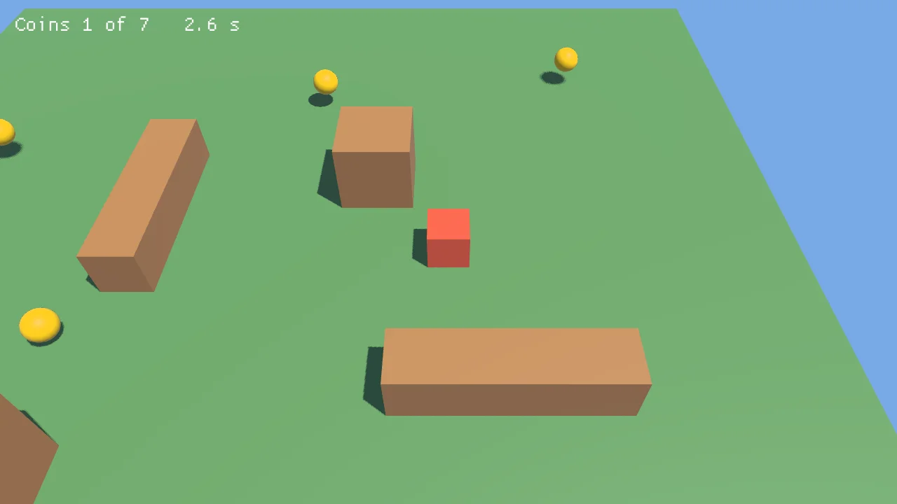
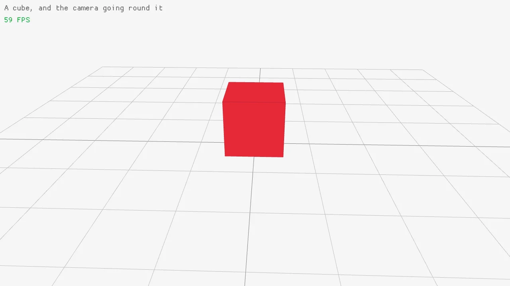
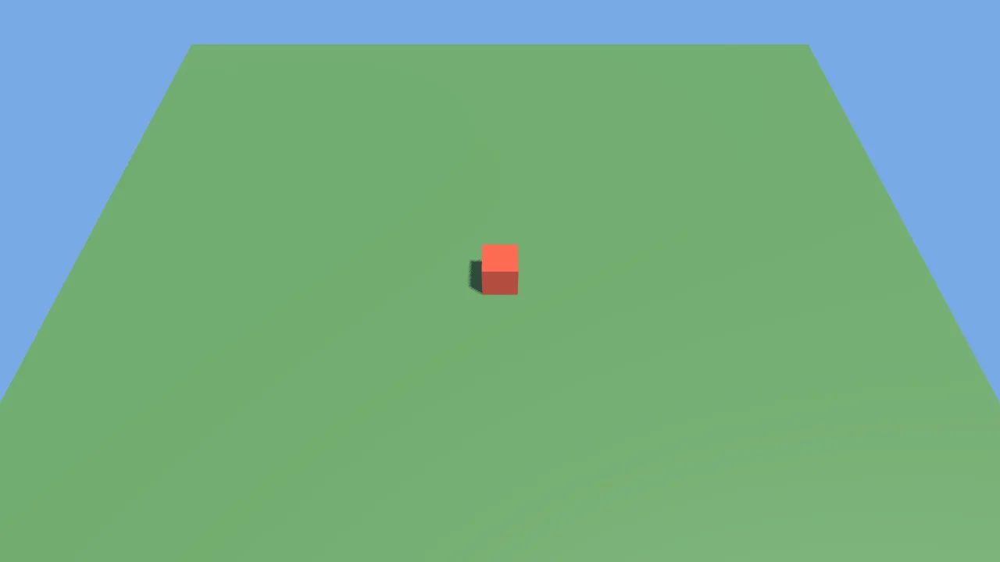
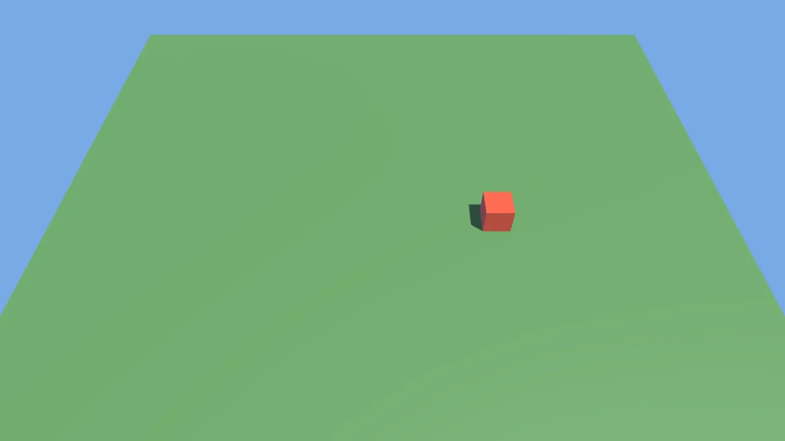
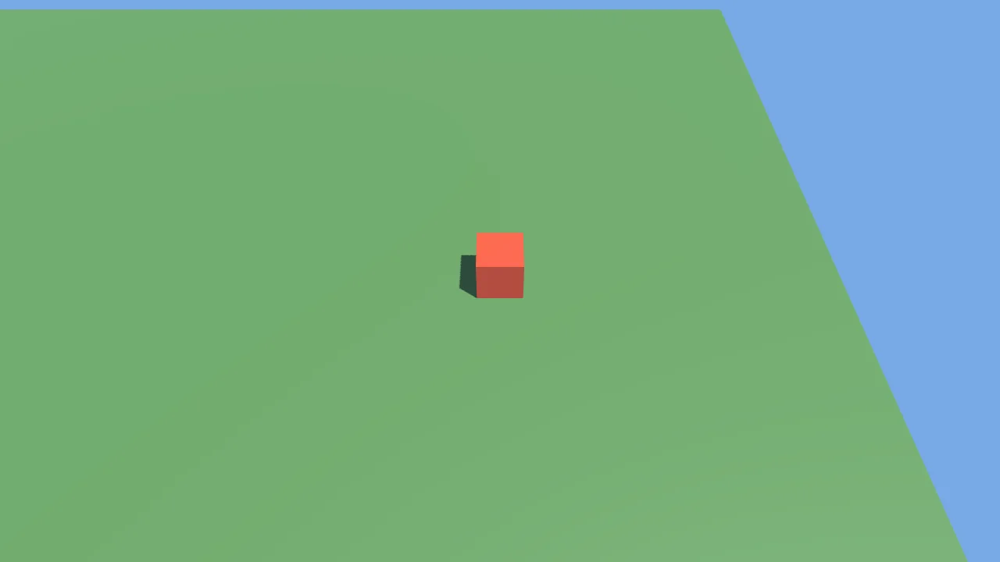
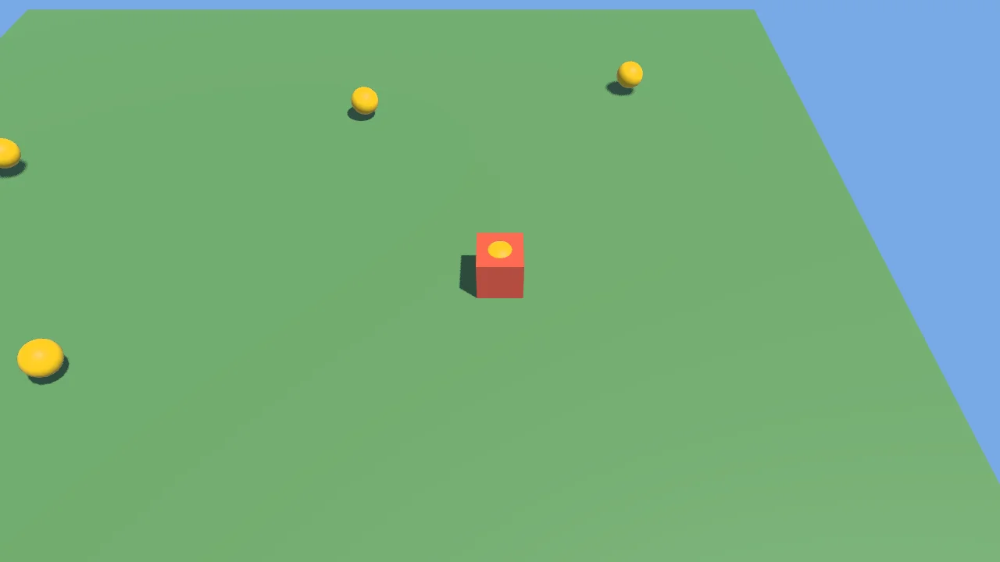
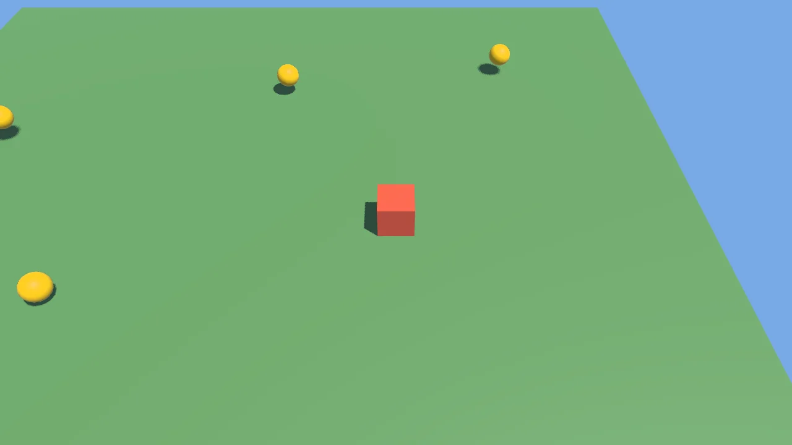
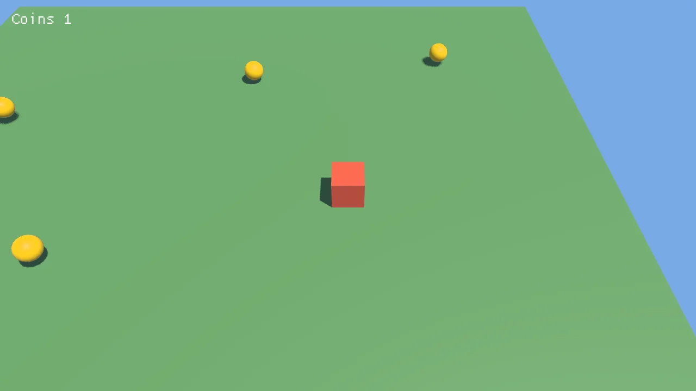
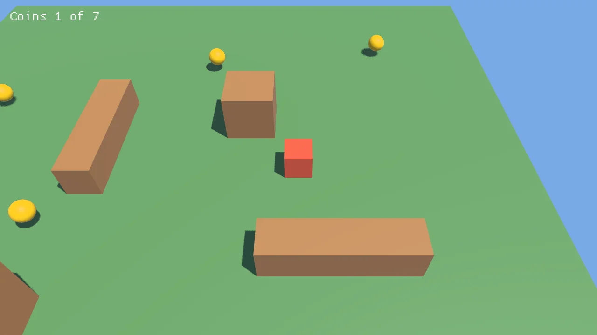

# A first game

This page makes a small game from an empty folder, a step at a time. A red block walks a field,
gold coins float over it, crates stand in the way, a chime plays as each coin is taken, the level
is a file of its own, and taking every coin wins, with R to play again. Each step adds a few lines
and shows what the window shows after them. The game is `games/FirstGame` in this repository,
where every step is a whole program under `steps/`, and CI builds and runs each one, so none of
them stops compiling.



## 1. A project

The templates make a project with a window, a loop and a cube:

```bash
dotnet new install 3DEngine.Templates
dotnet new 3dengine -n Coins && cd Coins
dotnet run
```

`Program.cs` is the whole game, and `resources/` holds what it loads. The window shows the cube and
a camera going round it.



## 2. A field, a sun and a player

The cube and its camera go, and `Program.cs` becomes a field under a sun, with the player on it.
Models are lit, where the shapes `DrawCube` draws are flat, so the field, the player and
everything after are models made from generated meshes, drawn with `DrawModel` at a place, a
scale and a color:

<!-- step 02 -->
```csharp
// A sun that casts shadows, and a little light from all around.
CreateDirectionalLight(new Vector3(-0.4f, -1, -0.3f), Color.White, 1.5f, castsShadows: true);
SetAmbientLight(new Color(180, 200, 255), 0.4f);

var box = LoadModelFromMesh(GenMeshCube(1, 1, 1));
var floor = LoadModelFromMesh(GenMeshPlane(20, 20, 1, 1));

var camera = new Camera3D(new Vector3(0, 12, 10), Vector3.Zero, Vector3.UnitY, 45);
var player = Vector3.Zero;
```

and inside the loop:

<!-- step 02 -->
```csharp
    BeginMode3D(camera);
    DrawModel(floor, Vector3.Zero, 1, new Color(90, 140, 80));
    DrawModel(box, player + new Vector3(0, 0.4f, 0), 0.8f, new Color(230, 90, 60));
    EndMode3D();
```



## 3. Walking

At the top of the loop, the keys say which way to walk, and the player walks four units a second.
`GetFrameTime` is the seconds the last frame took, so the speed is the same however fast frames
come. The way is normalized, so walking slantwise is no faster:

<!-- step 03 -->
```csharp
    var dt = GetFrameTime();

    // Walking, four units a second, the way the keys say.
    var move = Vector3.Zero;
    if (IsKeyDown(Key.W) || IsKeyDown(Key.Up)) move.Z -= 1;
    if (IsKeyDown(Key.S) || IsKeyDown(Key.Down)) move.Z += 1;
    if (IsKeyDown(Key.A) || IsKeyDown(Key.Left)) move.X -= 1;
    if (IsKeyDown(Key.D) || IsKeyDown(Key.Right)) move.X += 1;
    if (move != Vector3.Zero) player += Vector3.Normalize(move) * 4 * dt;
```



## 4. A camera that follows

The camera made once before the loop goes, and one made each frame looks down at the player from
behind and above it, so the player stays in the middle of the window as it walks:

<!-- step 04 -->
```csharp
    var camera = new Camera3D(player + new Vector3(0, 9, 8), player, Vector3.UnitY, 45);
```



## 5. Coins

A ball for the coins, a list of where they are, and each drawn floating up and down, by the sine of
the time, each a little apart from the others by its place:

<!-- step 05 -->
```csharp
var ball = LoadModelFromMesh(GenMeshSphere(0.3f, 16, 16));
```

<!-- step 05 -->
```csharp
// Coins to collect, each where it floats over the floor.
var coins = new List<Vector3>
{
    new(3, 0.5f, 0), new(-4, 0.5f, 2), new(0, 0.5f, -5), new(6, 0.5f, -6), new(-7, 0.5f, -3),
};
```

<!-- step 05 -->
```csharp
    foreach (var coin in coins)
        DrawModel(ball, coin + new Vector3(0, MathF.Sin((float)GetTime() * 3 + coin.X) * 0.15f, 0), 1, Color.Gold);
```



## 6. Taking them

After walking, a coin nearer the player than 0.8 is taken, out of the list and into the score. The
list is gone through from its end, so taking one does not skip the next:

<!-- step 06 -->
```csharp
var score = 0;
```

<!-- step 06 -->
```csharp
    // A coin within reach is collected.
    for (int i = coins.Count - 1; i >= 0; i--)
        if (Vector3.Distance(player with { Y = 0.5f }, coins[i]) < 0.8f)
        {
            coins.RemoveAt(i);
            score++;
        }
```



## 7. The score

After `EndMode3D`, the drawing is in pixels from the window's top left, and text goes over the
scene:

<!-- step 07 -->
```csharp
    DrawText($"Coins {score}", 20, 20, 30, Color.White);
```



## 8. A sound

A sound is usually a file in `resources/`, loaded with `LoadSound`. This one is made from its
samples, a quarter of a second of a tone that rises and fades, so the game needs no file for it.
`InitAudioDevice` opens the sound device after the window, and `CloseAudioDevice` closes it
before:

<!-- step 08 -->
```csharp
InitAudioDevice();
```

<!-- step 08 -->
```csharp
// A short rising chime, made from its samples rather than read from a file.
var samples = new float[11025];
for (int i = 0; i < samples.Length; i++)
{
    var t = i / 44100f;
    samples[i] = MathF.Sin(t * MathF.Tau * (880 + 880 * t * 4)) * (1 - i / (float)samples.Length) * 0.4f;
}
var ding = LoadSoundFromWave(new Wave { Samples = samples, SampleRate = 44100, Channels = 1 });
```

and `PlaySound(ding);` after `score++;` where a coin is taken.

## 9. The level in a file

The coins move out of the code into `resources/level.json`, a scene file, beside crates, so the
level can be changed without building the game again. Each entity has a place, and a `Coin` or a
`Crate`, components the game declares at the end of `Program.cs`. `[SceneComponent]` lets a scene
file hold them, and a crate keeps its size:

<!-- step 09 -->
```csharp
/// <summary>A coin to collect, placed by the level file.</summary>
[SceneComponent]
public struct Coin;

/// <summary>A crate in the way, its size in each direction.</summary>
[SceneComponent]
public struct Crate
{
    public Vector3 Size;
}
```

<!-- level -->
```json
{
  "format": "3dengine-scene",
  "version": 1,
  "entities": [
    { "components": { "Transform": { "Position": [3, 0.5, 0] }, "Coin": {} } },
    { "components": { "Transform": { "Position": [-4, 0.5, 2] }, "Coin": {} } },
    { "components": { "Transform": { "Position": [0, 0.5, -5] }, "Coin": {} } },
    { "components": { "Transform": { "Position": [6, 0.5, -6] }, "Coin": {} } },
    { "components": { "Transform": { "Position": [-7, 0.5, -3] }, "Coin": {} } },
    { "components": { "Transform": { "Position": [-6, 0.5, 7] }, "Coin": {} } },
    { "components": { "Transform": { "Position": [7, 0.5, 6] }, "Coin": {} } },
    { "components": { "Transform": { "Position": [1.5, 0.75, -2] }, "Crate": { "Size": [1.5, 1.5, 1.5] } } },
    { "components": { "Transform": { "Position": [-3, 0.5, -1] }, "Crate": { "Size": [1, 1, 4] } } },
    { "components": { "Transform": { "Position": [4, 0.5, 3] }, "Crate": { "Size": [4, 1, 1] } } },
    { "components": { "Transform": { "Position": [-4, 1, 5] }, "Crate": { "Size": [2, 2, 2] } } }
  ]
}
```

`LoadScene` makes an entity of each in the engine's ECS, and the game reads back where the coins
are and the box each crate fills, keeping the coins it started with for when it starts again:

<!-- step 09 -->
```csharp
// The level: where the coins and the crates are, read from a scene file.
var coinsAtStart = new List<Vector3>();
var crates = new List<BoundingBox>();
var ecs = GetApp().World.Resource<EcsWorld>();
foreach (var entity in LoadScene("resources/level.json"))
{
    var at = ecs.GetReadOnly<Transform>(entity).Position;
    if (ecs.Has<Coin>(entity)) coinsAtStart.Add(at);
    if (ecs.Has<Crate>(entity))
    {
        var half = ecs.GetReadOnly<Crate>(entity).Size / 2;
        crates.Add(new BoundingBox(at - half, at + half));
    }
}
```

<!-- step 09 -->
```csharp
var coins = new List<Vector3>(coinsAtStart);
```

The crates are drawn as the box stretched to each one's size, and the score counts against the
coins the level has:

<!-- step 09 -->
```csharp
    foreach (var crate in crates)
        DrawModelEx(box, (crate.Min + crate.Max) / 2, Vector3.UnitY, 0, crate.Max - crate.Min, new Color(170, 120, 70));
```

<!-- step 09 -->
```csharp
    DrawText($"Coins {score} of {coinsAtStart.Count}", 20, 20, 30, Color.White);
```



## 10. Crates in the way

The player walks through the crates, and off the field. The walk now works out where the player
would be, keeps it on the field, and takes it only when the box around the player there meets no
crate:

<!-- step 10 -->
```csharp
    if (move != Vector3.Zero)
    {
        var next = player + Vector3.Normalize(move) * 4 * dt;
        next = Vector3.Clamp(next, new Vector3(-9.5f, 0, -9.5f), new Vector3(9.5f, 0, 9.5f));
        var body = new BoundingBox(next - new Vector3(0.4f, 0, 0.4f), next + new Vector3(0.4f, 0.8f, 0.4f));
        if (!crates.Any(crate => CheckCollisionBoxes(body, crate))) player = next;
    }
```

A game with more to it would give the player and the crates bodies in the physics, as
[Physics](physics.md) shows, which slide along what they meet rather than stopping.

## 11. Winning, and again

A clock counts the seconds until the last coin, the walk stops once it is taken, and R puts every
coin back:

<!-- step 11 -->
```csharp
var time = 0f;
```

<!-- step 11 -->
```csharp
    var won = coins.Count == 0;
```

<!-- step 11 -->
```csharp
    if (!won) time += dt;

    // Every coin collected, R starts again.
    if (won && IsKeyPressed(Key.R))
    {
        (player, coins, score, time) = (Vector3.Zero, new List<Vector3>(coinsAtStart), 0, 0);
    }
```

<!-- step 11 -->
```csharp
    DrawText($"Coins {score} of {coinsAtStart.Count}   {time:0.0} s", 20, 20, 30, Color.White);
    if (won) DrawText($"All the coins in {time:0.0} seconds! R to play again", 20, 60, 30, Color.Yellow);
```

and the walk's test becomes `if (move != Vector3.Zero && !won)`. That is the whole game,
[`games/FirstGame/Program.cs`](../games/FirstGame/Program.cs).


## 12. A game a player runs

`dotnet publish` makes the game into a native executable that starts at once and needs nothing
installed, for Linux, Windows or a Mac:

```bash
dotnet publish -c Release -r linux-x64 -p:PublishAot=true -o publish    # or win-x64, osx-arm64
```

`publish/` then holds `Coins`, 11 MB, beside SDL3's, Dear ImGui's and Assimp's libraries,
`resources/` and the engine's shaders compiled ahead, and the folder is the game, to zip and give
away. [Shipping a game](shipping-a-game.md) says what a publish leaves out and why.

## Where next

The [guide](../README.md#guide) takes each area further: [Input](input.md) for a gamepad,
[Audio](audio.md) for music, [Scenes](scenes.md) for levels inside levels, and
[Behaviors and the ECS](behaviors-and-the-ecs.md) for a game whose coins are behaviors, as the
`dotnet new 3dengine-ecs` template starts one.
